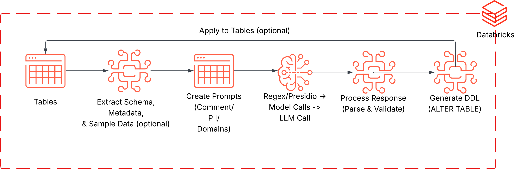

# dbxmetagen: GenAI-Assisted Metadata Generation and Management for Databricks



**dbxmetagen** is a utility for generating high-quality metadata for Unity Catalog, and includes the ability to identify and classify data and metadata in various ways to assist enrichment of Unity Catalog, and quickly building up data catalogs for governance purposes.

Options:
- descriptions for tables and columns in Databricks, enhancing enterprise search, governance, Databricks Genie performance, and any other tooling that benefit significantly from high quality metadata. 
- identify and classify columns and tables into personal information (PI) into PII, PHI, and PCI.
- predict domain + subdomain for tables

The tool is highly configurable, supporting bulk operations, SDLC integration, and fine-grained control over privacy and output formats.

## Quickstart

1. **Clone the repo** into a Git Folder in your Databricks workspace
   ```
   Create Git Folder → Clone https://github.com/databricks-industry-solutions/dbxmetagen
   ```

2. **Open the notebook**: `notebooks/generate_metadata.py`

3. **Run the first few cells to setup widgets, then fill in the widgets**:
   - **catalog_name** (required): Your Unity Catalog name
   - **table_names** (required): Comma-separated list (e.g., `catalog.schema.table1, catalog.schema.table2`). You can provide entire schemas as `catalog.schema.*`. Use test tables or a small schema for initial runs.
   - **metadata_type**: Choose `comment`, `pi`, or `domain`
   - Adjust other widgets as needed (all have sensible defaults)

4. **Run the notebook** - metadata will be generated. If you change apply_ddl to true, then the DDL will be applied to your tables.

That's it! No YAML files to edit, no deployment scripts to run.

If you want to take the next step with this same quickstart approach:
1. Update notebooks/table_names.csv instead of the table names widget.
2. Explore the review functionality - sync_reviewed_ddl notebook.
3. Review some of the advanced options in variables.yml
4. Manually create a Databricks job and run notebooks/generate_metadata.py as a task.
5. Move to full deployment using Databricks Asset Bundles - only necessary to use the app, otherwise everything can be done with a simple git clone into the workspace.

---

### Full App Deployment (Recommended for Regular Use)

For a web UI with job management, metadata review, and team collaboration:

1. **Prerequisites**:
   - Databricks CLI installed and configured: `databricks configure --profile <your-profile>`
   - You may need to use `databricks auth login --profile <your-profile>`
   - Python 3.10+, Poetry (for building a wheel when using Databricks asset bundles)

2. **Configure environment**:
   ```bash
   cp example.env dev.env
   # Edit dev.env with your workspace URL and permission groups/users
   Update databricks.yml host for asset bundle deploy
   ```

3. **Deploy**:
   ```bash
   ./deploy.sh --profile <your-profile> --target <your-dab-target>
   ```

4. **Access**: Go to **Databricks Workspace → Apps → dbxmetagen-app**

See [docs/ENV_SETUP.md](docs/ENV_SETUP.md) for detailed deployment documentation.

---

### What You Can Generate

- **Comments**: AI-generated descriptions for tables and columns
- **PI Classification**: Identify and tag PII, PHI, and PCI with Unity Catalog tags
- **Domain Classification**: Automatically categorize tables into business domains and subdomains with Unity Catalog tags

## Disclaimer

- AI-generated metadata must be human-reviewed for full compliance.
- Generated comments may include data samples or metadata, depending on settings.
- Compliance (e.g., HIPAA) is the user's responsibility.
- Unless configured otherwise, dbxmetagen inspects data and sends it to the specified model endpoint. There are a wide variety of options to control this behavior in detail.

## Solution Overview

- **Configuration-driven:** Basic required settings can be managed via widgets and in the app config. Advanced settings are managed via `variables.yml`.
- **AI-assisted:** Both comment generation and PI identification and classification use both AI-based and deterministic or data engineering approaches, combining multiple sophisticated approaches to get you quality metadata.
- **Data Sampling:** Controls over sample size, inclusion of data, and metadata.
- **Validation:** Uses `Pydantic` and structured outputs for schema enforcement.
- **Logging:** Tracks processed tables and results.
- **DDL Generation:** Produces `ALTER TABLE` statements for integration.
- **Manual Overrides:** Supports CSV-based overrides for granular control.

## User Guide

### Entry points
Both primary entry points for this application are Databricks notebooks.

- **dbxmetagen/src/notebooks/generate_metadata** This is the primary entry point for the application, allowing both comment generation and PI identification and classification.
- **dbxmetagen/src/notebooks/sync_reviewed_ddl** This utility allows re-integration of reviewed and edited run logs in tsv or excel format to be used to apply DDL to tables.

For detailed information on how different team members use dbxmetagen, see [docs/PERSONAS_AND_WORKFLOWS.md](docs/PERSONAS_AND_WORKFLOWS.md).

### Workflow Diagrams

- **Simple Workflow:** Clone repo, configure widgets, update `notebooks/table_names.csv`, run notebook.

- **Advanced Workflow:** Adjust PI definitions, acronyms, secondary options; use asset bundles or web terminal for deployment; leverage manual overrides.

### Additional Setup Details
1. Clone the Repo into Databricks or locally
1. If cloned into Repos in Databricks, one can run the notebook using an all-purpose cluster (tested on 14.3 ML LTS, 15.4 ML LTS, 16.4 ML) without further deployment, simply adjusting variables.yml and widgets in the notebook.
1. If cloned locally, we recommend using Databricks asset bundle build to create and run a workflow.
1. Either create a catalog or use an existing one. If using the app, app SPN will need permissions on the catalog.
1. Same for schema and volume, defaults are in variables.yml.
1. Whether using asset bundles, or the notebook run, adjust the host urls, catalog name, and if desired schema name in resources/variables/variables.yml.
1. Review the settings in the config.py file in src/dbxmetagen to whatever settings you need. If you want to make changes to variables in your project, change them in the notebook widget.
   1. Make sure to check the options for add_metadata and apply_ddl and set them correctly. Add metadata will run a describe extended on every column and use the metadata in table descriptions, though ANALYZE ... COLUMNS will need to have been run to get useful information from this.
   1. You also can adjust sample_size, columns_per_call, and ACRO_CONTENT, as well as many other variables in variables.yml.
   1. Point to a test table to start, though by default DDL will not be applied, instead it will only be generated and added to .sql files in the volume generated_metadata.
   1. Settings in the notebook widgets will override settings in config.py, so make sure the widgets in the main notebook are updated appropriately.
1. In notebooks/table_names.csv, keep the first row as _table_name_ and add the list of tables you want metadata to be generated for. Add them as <schema>.<table> if they are in the same catalog that you define your catalog in variables.yml file separately, or you can use a three-level namespace for these table names. You can also provide <catalog>.<schema>.* to run against all tables in a schema.

### Configurations
Most configurations that users should change are in variables.yml. There are a variety of useful options, please read the descriptions, I will not rewrite them all here.

Key settings in `variables.yml`:

**Privacy:**
- `allow_data`: false = no data sent to LLMs (maximum privacy)
- `sample_size`: Number of rows sampled (0 = no sampling)
- `allow_data_in_comments`: Control data in generated comments

**Model:**
- `model`: LLM endpoint (recommend `databricks-meta-llama-3-3-70b-instruct` or `databricks-claude-3-7-sonnet`)
- `columns_per_call`: Columns per LLM call (5-10 recommended)
- `temperature`: Model creativity (0.1 for consistency)

**Workflow:**
- `apply_ddl`: Apply changes directly to Unity Catalog (false = generate only)
- `ddl_output_format`: Output format (excel, tsv, or sql)

**PI Detection:**
- `include_deterministic_pi`: Use Presidio for rule-based detection
- `disable_medical_information_value`: Treat all medical data as PHI

For complete configuration reference, see [docs/CONFIGURATION.md](docs/CONFIGURATION.md).

## Current Status

- Tested on DBR 17.4 LTS, 16.4 LTS, and 15.4 LTS, as well as the ML versions.
- Serverless runtimes tested extensively but runtimes are less consistent.
- Views only work on 16.4. Pre-16.4, alternative DDL is used that only works on tables.
- Excel writes for metadata generator or sync_reviewed_ddl only work on ML runtimes. If you must use a standard runtime, leverage tsv.

## Discussion Points & Recommendations

- **Throttling:** Default endpoints may throttle during large or concurrent jobs.
- **Sampling:** Balance sample size for accuracy and performance.
- **Chunking:** Fewer columns per call yield richer comments but may increase cost/time.
- **Security:** Default endpoints are not HIPAA-compliant; configure secure endpoints as needed.
- **PI Mode:** Use more rows and smaller chunks for better PI detection.

## Domain Classification

Automatically categorizes tables into business domains and subdomains by analyzing table data and schema metadata. Tags are applied to Unity Catalog for better data organization and discovery.

**Configuration:** Edit `configurations/domain_config.yaml` to match your organization's business structure. Default domains include Finance, Clinical, CRM, HR, Operations, Marketing, Product, IT, and Legal.

**Customization:**
1. Copy and modify `domain_config.yaml`
2. Add/remove domains and subdomains
3. Update descriptions and keywords for your industry
4. Test on sample tables and refine

Review domain assignments in the Streamlit app or exported run logs before applying to Unity Catalog.

## License

This project is licensed under the Databricks DB License.

## Analysis of Packages Used

| Package | License | Source |
|---------|---------|--------|
| mlflow >=2.22.1 | Apache 2.0 | https://github.com/mlflow/mlflow |
| openai >=1.99.9 | Apache 2.0 | https://github.com/openai/openai-python |
| cloudpickle 3.1.0 | BSD 3-Clause | https://github.com/cloudpipe/cloudpickle |
| pydantic >=2.10.1 | MIT | https://github.com/pydantic/pydantic |
| ydata-profiling 4.12.1 | MIT | https://github.com/ydataai/ydata-profiling |
| databricks-langchain 0.7.1 | Apache 2.0 | https://github.com/databricks/databricks-ai-bridge |
| databricks-sdk >=0.30.0 | Apache 2.0 | https://github.com/databricks/databricks-sdk-py |
| openpyxl 3.1.5 | MIT | https://foss.heptapod.net/openpyxl/openpyxl |
| spacy 3.8.7 | MIT | https://spacy.io/models/en#en_core_web_lg |
| en_core_web_lg 3.8.0 | MIT | https://github.com/explosion/spacy-models |
| presidio-analyzer 2.2.358 | MIT | https://github.com/microsoft/presidio |
| presidio-anonymizer 2.2.358 | MIT | https://github.com/microsoft/presidio |
| requests >=2.25.0 | Apache 2.0 | https://github.com/psf/requests |
| numpy | BSD-3-Clause | https://github.com/numpy/numpy |
| pandas |	BSD-3-Clause | https://github.com/pandas-dev/pandas |
| pyspark |	Apache 2.0 | https://github.com/apache/spark |
| cloudpickle==2.2.1 | BSD-3 | https://github.com/cloudpipe/cloudpickle |
| streamlit | Apache 2.0 | https://github.com/streamlit |
| databricks-sdk | Apache 2.0 | https://pypi.org/project/databricks-sdk/ |
| databricks-sql-connector | Apache 2.0 | https://github.com/databricks/ |
| pyyaml>=6.0 | MIT | https://pypi.org/project/PyYAML/ |
| requests>=2.25.0 | Apache | https://pypi.org/project/requests/ |
| plotly>=5.0.0 | MIT | https://pypi.org/project/plotly/ |
| deprecated | MIT | https://pypi.org/project/Deprecated/ |
| grpcio | Apache | https://pypi.org/project/grpcio/ |


**All packages are open source with permissive licenses** (Apache 2.0, MIT, BSD 3-Clause) that allow commercial use, modification, and redistribution.

**Other libraries used come from the Databricks runtime**

## Acknowledgements
Thanks to James McCall, Diego Malaver, Aaaron Zavora, and Charles Linville for discussions around dbxmetagen.

For detailed configuration options, see [docs/CONFIGURATION.md](docs/CONFIGURATION.md).

For user workflows and team roles, see [docs/PERSONAS_AND_WORKFLOWS.md](docs/PERSONAS_AND_WORKFLOWS.md).
