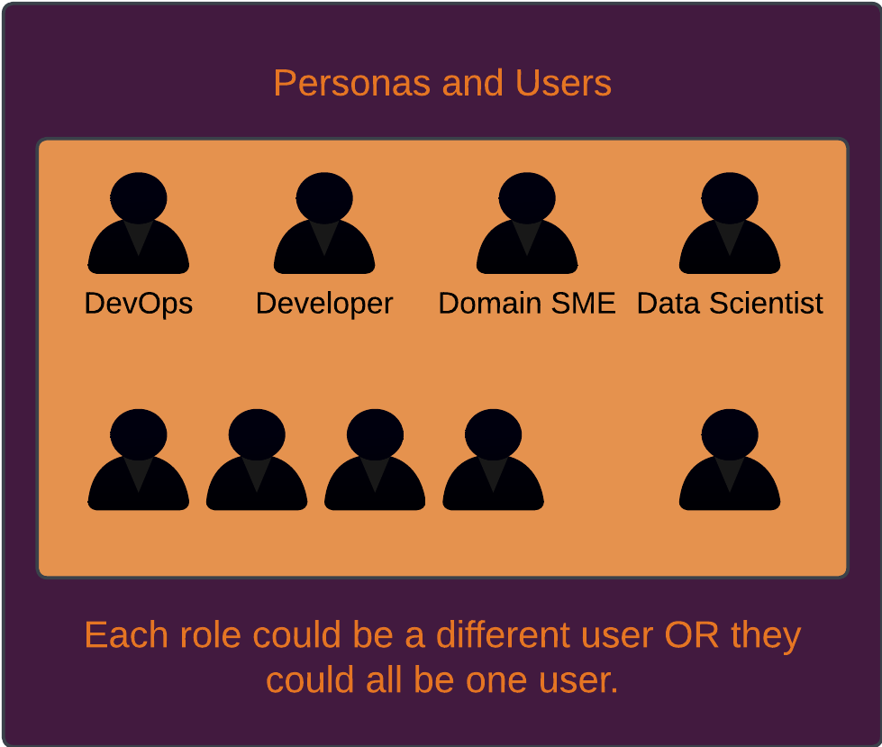
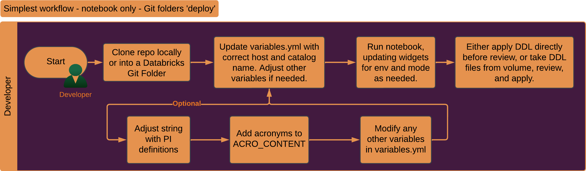
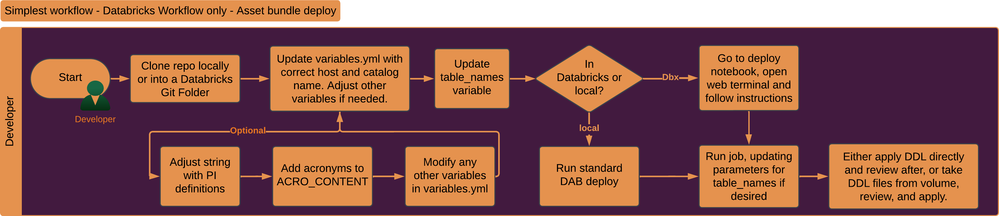

# dbxmetagen: GenAI-Assisted Metadata Generation and Management for Databricks

## Table of Contents

- [Project Overview](#project-overview)
- [Disclaimer](#disclaimer)
- [Quickstart] (#quickstart)
- [Solution Overview](#solution-overview)
- [User Guide](#user-guide)
  - [Personas](#personas)
  - [Workflow Diagrams](#workflow-diagrams)
- [Minimal Setup](#minimal-setup)
- [Full Setup Instructions](#full-setup-instructions)
- [Configuration Reference](#configuration-reference)
- [Workflow and Usage Patterns](#workflow-and-usage-patterns)
- [Current Status](#current-status)
- [Discussion Points & Recommendations](#discussion-points--recommendations)
- [Details of Comment Generation and PI Identification](#details-of-comment-generation-and-pi-identification)
- [Domain Classification](#domain-classification)
- [Performance Details and Skew](#performance-details-and-skew)
- [Under Development](#under-development)
- [License](#license)
- [Acknowledgements](#acknowledgements)

## Project Overview


**dbxmetagen** is a utility for generating high-quality metadata for Unity Catalog.

Options:
- descriptions for tables and columns in Databricks, enhancing enterprise search, governance, Databricks Genie performance, and any other tooling that benefit significantly from high quality metadata. 
- identify and classify columns and tables into personal information (PI) into PII, PHI, and PCI.
- predict domain + subdomain for tables

The tool is highly configurable, supporting bulk operations, SDLC integration, and fine-grained control over privacy and output formats.

**Quickstart**

1. **Clone the repo** into a Git Folder in your Databricks workspace
   ```
   Create Git Folder → https://github.com/databricks-industry-solutions/dbxmetagen
   ```

2. **Open the notebook**: `notebooks/generate_metadata.py`

3. **Run the first few cells to setup widgets, then fill in the widgets**:
   - **catalog_name** (required): Your Unity Catalog name
   - **table_names** (required): Comma-separated list (e.g., `catalog.schema.table1, catalog.schema.table2`). You can provide entire schemas as `catalog.schema.*`. Use test tables or a small schema for initial runs.
   - **metadata_type**: Choose `comment`, `pi`, or `domain`
   - Adjust other widgets as needed (all have sensible defaults)

4. **Run the notebook** - metadata will be generated. If you change apply_ddl to true, then the DDL will be applied to your tables.

That's it! No YAML files to edit, no deployment scripts to run.

If you want to take the next step with this same quickstart approach:
1. Update notebooks/table_names.csv instead of the table names widget.
2. Explore the review functionality
3. Review some of the advanced options in variables.yml
4. Manually create a Databricks job and run notebooks/generate_metadata.py as a task.

---

### Full App Deployment (Recommended for Regular Use)

For a web UI with job management, metadata review, and team collaboration:

1. **Prerequisites**:
   - Databricks CLI installed and configured: `databricks configure --profile <your-profile>`
   - Python 3.9+, Poetry (for building the wheel)

2. **Configure environment**:
   ```bash
   cp example.env dev.env
   # Edit dev.env with your workspace URL and permission groups/users
   Update datbricks.yml host for asset bundle deploy
   ```

3. **Deploy**:
   ```bash
   ./deploy.sh --profile <your-profile>
   ```

4. **Access**: Go to **Databricks Workspace → Apps → dbxmetagen-app**

See [docs/ENV_SETUP.md](docs/ENV_SETUP.md) for detailed deployment documentation.

---

### What You Can Generate

- **Comments**: AI-generated descriptions for tables and columns
- **PI Classification**: Identify and tag PII, PHI, and PCI with Unity Catalog tags
- **Domain Classification**: Automatically categorize tables into business domains and subdomains with Unity Catalog tags

## Disclaimer

- AI-generated metadata must be human-reviewed for full compliance.
- Generated comments may include data samples or metadata, depending on settings.
- Compliance (e.g., HIPAA) is the user's responsibility.
- Unless configured otherwise, dbxmetagen inspects data and sends it to the specified model endpoint. There are a wide variety of options to control this behavior in detail.

## Solution Overview

- **Configuration-driven:** Basic required settings can be managed via widgets and in the app config. Advanced settings are managed via `variables.yml`.
- **AI-assisted:** Both comment generation and PI identification and classification use both AI-based and deterministic or data engineering approaches, combining multiple sophisticated approaches to get you quality metadata.
- **Data Sampling:** Controls over sample size, inclusion of data, and metadata.
- **Validation:** Uses `Pydantic` and structured outputs for schema enforcement.
- **Logging:** Tracks processed tables and results.
- **DDL Generation:** Produces `ALTER TABLE` statements for integration.
- **Manual Overrides:** Supports CSV-based overrides for granular control.

## User Guide

### Entry points
Both primary entry points for this application are Databricks notebooks.

- **dbxmetagen/src/notebooks/generate_metadata** This is the primary entry point for the application, allowing both comment generation and PI identification and classification.
- **dbxmetagen/src/notebooks/sync_reviewed_ddl** This utility allows re-integration of reviewed and edited run logs in tsv or excel format to be used to apply DDL to tables.

### Personas

- **Data Engineer:** Sets up and maintains the tool.
- **Data Steward:** Reviews and approves generated metadata.
- **Data Scientist/Analyst:** Uses enriched metadata.
- **Compliance Officer:** Ensures regulatory requirements are met.

### Workflow Diagrams

- **Simple Workflow:** Clone repo, configure widgets, update `notebooks/table_names.csv`, run notebook.



- **Advanced Workflow:** Adjust PI definitions, acronyms, secondary options; use asset bundles or web terminal for deployment; leverage manual overrides.

<br/>
<br/>

 

<br/>
<br/>

 

<br/>
<br/>

### Additional Setup Details
1. Clone the Repo into Databricks or locally
1. If cloned into Repos in Databricks, one can run the notebook using an all-purpose cluster (tested on 14.3 ML LTS, 15.4 ML LTS, 16.4 ML) without further deployment, simply adjusting variables.yml and widgets in the notebook.
1. If cloned locally, we recommend using Databricks asset bundle build to create and run a workflow.
1. Either create a catalog or use an existing one. If using the app, app SPN will need permissions on the catalog.
1. Same for schema and volume, defaults are in variables.yml.
1. Whether using asset bundles, or the notebook run, adjust the host urls, catalog name, and if desired schema name in resources/variables/variables.yml.
1. Review the settings in the config.py file in src/dbxmetagen to whatever settings you need. If you want to make changes to variables in your project, change them in the notebook widget.
   1. Make sure to check the options for add_metadata and apply_ddl and set them correctly. Add metadata will run a describe extended on every column and use the metadata in table descriptions, though ANALYZE ... COLUMNS will need to have been run to get useful information from this.
   1. You also can adjust sample_size, columns_per_call, and ACRO_CONTENT, as well as many other variables in variables.yml.
   1. Point to a test table to start, though by default DDL will not be applied, instead it will only be generated and added to .sql files in the volume generated_metadata.
   1. Settings in the notebook widgets will override settings in config.py, so make sure the widgets in the main notebook are updated appropriately.
1. In notebooks/table_names.csv, keep the first row as _table_name_ and add the list of tables you want metadata to be generated for. Add them as <schema>.<table> if they are in the same catalog that you define your catalog in variables.yml file separately, or you can use a three-level namespace for these table names. You can also provide <catalog>.<schema>.* to run against all tables in a schema.

### Configurations
1. Most configurations that users should change are in variables.yml. There are a variety of useful options, please read the descriptions, I will not rewrite them all here.

### Current status
1. Tested on DBR 14.3, 15.4, and 16.4.
1. Default settings currently create ALTER scripts and puts in a volume. Tested in a databricks workspace.
1. Some print-based logging to make understanding what's happening and debugging easy in the UI.

### Discussion points and recommendations:
1. Throttling - the default PPT endpoints will throttle eventually. Likely this will occur wehn running backfills for large numbers of tables, or if you have other users using the same endpoint.
1. Sampling - setting a reasonable sample size for data will serve to provide input from column contents without leading to swamping of column names.
1. Chunking - running a smaller number of columns at once will result in more attention paid and more tokens PER column but will probably cost slightly more and take longer.
1. One of the easiest ways to speed this up and get terser answers is to ramp up the columns per call - compare 5 and 50 for example. This will impact complexity of results.
1. Larger chunks will result in simpler comments with less creativity and elaboration.
1. Remember that PPT endpoints (the default) are not HIPAA compliant, you are responsible for setting up appropriate endpoints for your security needs.
1. For 'pi' mode, the recommendation is to potentially use more rows of data, and smaller chunks given that scanning the data is important for identifying PI.

## Full Setup Instructions

1. **Clone the repository** into Databricks or locally.
2. **Configure variables:** Adjust `variables.yml` and notebook widgets.
3. **Deploy:** Run notebook directly or use `deploy.py` for asset bundle deployment.
4. **Review and adjust settings:** Tweak options in `variables.yml` and `config.py`.
5. **Add table names** in `notebooks/table_names.csv`.
6. **Run and review outputs:** Generated DDL scripts are stored in the `generated_metadata` volume.

## Details

1. Some errors are silent by design, but they always show up in the log table, so review it if you are not seeing the outputs you expect.
1. If you get an error partway through a run, the control table will still keep in memory the tables you entered the first time that haven't run yet, so you should be able to remove the table names from table_names.csv and run it again and it should pick up any unfinished tables. If you don't, you'll see that they all get run again anyways. This checkpointing is a feature.
1. To make sure that column constraints are interpretable, make sure the constraint names relate to the column that they constrain, as constraints are pulled from the table metadata, not the column metadata, and they describe the constraint name, not the columns with the constraint.
1. If you get a Pydantic validation error, it's most likely due to some atypical details of your data or metadata in the specific failing table. First thing to try is another LLM - switch to llama from sonnet or vice versa for example. If that doesn't work, please open an issue on the repo.

## Configuration Reference

Below is a table summarizing all configuration variables, their descriptions, and defaults. Each variable can be set in `variables.yml` to control workflow, privacy, output, and model behavior.

| Variable | Description | Default |
|----------|-------------|---------|
| catalog_name | Target catalog for data, models, and files. If source tables are here, only schema.table needed; otherwise, fully scoped names required. | dbxmetagen |
| host | Base URL host. Overridden by asset bundles if used. | https://adb-830292400663869.9.azuredatabricks.net/ |
| allow_data | If false, no data sent to LLMs, no data in comments, and no data-based metadata. Reduces output quality. Also sets sample_size=0, allow_data_in_comments=false, include_possible_data_fields_in_metadata=false. | false |
| sample_size | Number of rows to sample per chunk for prompt generation. 0 disables data sampling. | 10 |
| disable_medical_information_value | If true, all medical info is treated as PHI for maximum security. | true |
| allow_data_in_comments | If true, allows data to appear in comments. Does not prevent data from being used as input. | true |
| add_metadata | If true, uses metadata from information schema and DESCRIBE EXTENDED ... COMPUTE STATISTICS. May slow process and can leak data via min/max. | true |
| include_datatype_from_metadata | If true, includes datatype in comment generation. | false |
| include_possible_data_fields_in_metadata | If true, includes fields from extended metadata that may leak PII/PHI. Useful for Genie. | true |
| catalog_tokenizable | Tokenizable catalog name; supports string formatting for environment. | __CATALOG_NAME__ |
| format_catalog | If true, formats bracketed variables in catalog name; otherwise, keeps as literal. | false |
| model | LLM endpoint for model calls. Recommend databricks-claude-3-7-sonnet or databricks-meta-llama-3-3-70b-instruct. | databricks-meta-llama-3-3-70b-instruct |
| job_table_names | Default table names if no host overrides. | default.simple_test |
| apply_ddl | If true, applies DDL directly to environment (alters tables). | false |
| ddl_output_format | Output format for DDL: SQL file (default) or TSV. | excel |
| reviewable_output_format | Format for full run output for reviewability. | excel |
| include_deterministic_pi | If true, runs presidio analyzer before LLM-based PI identification. | true |
| spacy_model_names | spaCy models to use in presidio. Only single model supported currently. | en_core_web_lg |
| pi_classification_rules | Rules for PI classification, injected into prompts. See below for full default. | See below |
| allow_manual_override | If true, allows manual overrides via CSV. | true |
| override_csv_path | Path for manual override CSV. | metadata_overrides.csv |
| tag_none_fields | If true, tags fields with no PI; otherwise, leaves untagged. | true |
| max_prompt_length | Maximum prompt length for LLM. | 4096 |
| word_limit_per_cell | Maximum number of words per cell from source tables (truncates longer values). | 100 |
| limit_prompt_based_on_cell_len | If true, truncates cells longer than word_limit_per_cell. | true |
| columns_per_call | Number of columns sent to LLM per chunk. | 5 |
| max_tokens | Maximum tokens for model output. | 4096 |
| temperature | Temperature parameter for LLM. | 0.1 |
| acro_content | Acronyms used in data, provided as a dictionary. | {"DBX":"Databricks","WHO":"World Health Organization","GMC":"Global Marketing Code"} |
| schema_name | Primary schema for outputs. Not the source schema. | metadata_results |
| volume_name | Volume for storing DDL files. | generated_metadata |
| registered_model_name | Registered model name. | default |
| model_type | Model type. | default |
| table_names_source | Path variable to table names. | csv_file_path |
| source_file_path | Path to source file for table names. | table_names.csv |
| current_user | User deploying the bundle. | ${workspace.current_user.userName} |
| current_working_directory | Working directory or bundle root. | /Users/${var.current_user}/.bundle/${bundle.name}/${bundle.target} |
| control_table | Control table name. | metadata_control_{} |
| dry_run | If true, performs a dry run (not yet implemented). Setting volume_name to null and apply_ddl to false is an effective dry run. | false |
| pi_column_field_names | Field names for PI columns (not yet implemented). | default |
| review_input_file_type | Input file type for reviewed DDL (excel or tsv). | tsv |
| review_output_file_type | Output file type for reviewed DDL (sql, excel, or tsv). | excel |
| review_apply_ddl | If true, applies all DDL after running 'sync_reviewed_ddl'. | false |

### Default PI Classification Rules

```
PII (Personally Identifiable Information): Any data that can identify an individual, such as name, address, or social security number. PHI (Protected Health Information): Health-related data that includes any of the 18 HIPAA-identified elements, like medical records or treatment histories. PCI (Payment Card Information): Data related to payment card transactions, including card numbers, expiration dates, and security codes. Non-PII/PHI/PCI: Data that cannot be used to identify an individual or is not related to health or payment cards, such as general demographics or anonymized statistics.
###
To identify these types:
###
PII: Look for column names or data containing personal details like 'full_name', 'address', 'ssn', 'email', or 'phone_number'.
PHI: Search for health-related terms in column names or data, such as 'medical_record_number', 'diagnosis', 'treatment_date', or any of the 18 HIPAA identifiers.
PCI: Identify columns or data with payment card-related terms like 'card_number', 'expiration_date', 'cvv', or 'cardholder_name'.
Non-PII/PHI/PCI: Look for general, non-identifying information like 'zip_code' (without other identifiers), 'age_group', or 'product_category'.
###
Tables with PII vs columns with PII:
###
If a column has only PII, then it should be considered only PII, even if other columns in the table have medical information in them. A specific example of this is that if a column only contains name, or address, then it should be marked as pii, not as phi. However, the column containing medical information would be considered PHI because it pertains to the health status, provision of health care, or payment for health care that can be linked to an individual.

If a table has columns with both PII and PHI, or with PII and medical information, then the table itself has PHI.
```


## Workflow and Usage Patterns

### Privacy and Security Controls

- **allow_data, allow_data_in_comments, sample_size, include_possible_data_fields_in_metadata:** Together, these control whether data is sent to LLMs, appears in comments, or is used in metadata. Setting `allow_data` to false disables all data-related features for maximum privacy.
- **disable_medical_information_value:** Converts all medical info to PHI for stricter compliance.
- **add_metadata, include_datatype_from_metadata:** Control how much metadata is used, balancing richness against privacy.
- **tag_none_fields:** Controls whether columns classified as 'None' for PI are explicitly tagged.

### Output and Review

- **ddl_output_format, reviewable_output_format, review_input_file_type, review_output_file_type:** Control output formats for DDL and review files, supporting SQL, TSV, and Excel.
- **volume_name:** Specifies where generated files are stored.
- **apply_ddl, review_apply_ddl:** Control whether DDL is applied directly or only generated for review.

Each run will export an 'exportable run log' to a folder named the same. This run log can be TSV or Excel, and will include every table that was run during that run. 
Exportable run logs can be modified and input to the review process. Do this by checking the variables 'review_input_file_type', 'review_output_file_type', 'review_apply_ddl', and 'column_with_reviewed_ddl' and setting them to desired values. Note that 'review_apply_ddl' will apply ddl to tables. 

Put the file you want to review in 'reviewed_outputs' folder in your user folder and put the filename in the sync_reviewed_ddl notebook widget, and run the notebook. A file will be updated and output.

### Model and Prompt Tuning

- **model, temperature, max_prompt_length, max_tokens, columns_per_call:** Tune LLM endpoint and prompt parameters for desired output quality and performance.
- **acro_content:** Provide domain-specific acronyms for better metadata generation.
- **include_deterministic_pi, spacy_model_names:** Integrate deterministic PI detection (e.g., Presidio) before LLM-based classification.

### Manual Overrides and Advanced Control

- **allow_manual_override, override_csv_path:** Allow manual specification of metadata via CSV, overriding automated results.
- **control_table, dry_run:** Support for checkpointing, re-running incomplete tables, and dry-run testing.
- **pi_column_field_names:** (Planned) Custom field names for PI columns.

### Environment and Deployment

- **catalog_name, schema_name, host, catalog_tokenizable, format_catalog:** Control where data and metadata are stored and how environment variables are handled.
- **job_table_names, table_names_source, source_file_path:** Control sources for table lists.
- **current_user, current_working_directory:** Support for multi-user and multi-environment deployments.

## Advanced Features and Implementation Details

### 1. Data Processing and Sampling

- **DataFrames are chunked** according to `columns_per_call` for scalable prompt generation.
- **Sampling logic** ensures that only a representative, non-null-heavy subset of data is sent to the LLM, controlled by `sample_size` and filtered for nulls.
- **Truncation of data cells** is enforced by `word_limit_per_cell` and `limit_prompt_based_on_cell_len`, ensuring prompts stay within token limits and privacy constraints.

### 2. Metadata Extraction and Prompt Generation

- **Extended metadata** (from `DESCRIBE EXTENDED`) is filtered and included/excluded in prompts based on `add_metadata`, `include_datatype_from_metadata`, and `include_possible_data_fields_in_metadata`.
- **Prompt construction** is performed by specialized classes (e.g., `CommentPrompt`, `PIPrompt`, `CommentNoDataPrompt`), which format input for the LLM and enforce output structure.
- **Acronym expansion** is supported via the `acro_content` dictionary, unpacking abbreviations in generated comments.

### 3. PI Detection and Classification

- **Deterministic PI detection** (via Presidio) can be run before LLM-based identification (`include_deterministic_pi`), and results are incorporated into prompt context.
- **Classification logic** is enforced both at the column and table level, with rules for PHI/PII/PCI inheritance and prioritization.
- **Manual PI tagging** is possible through CSV overrides, with `allow_manual_override` and `override_csv_path`.

### 4. DDL and Output Generation

- **DDL statements** for comments and PI tagging are generated as SQL, TSV, or Excel files, with output paths constructed dynamically based on user, date, and run context.
- **Direct DDL application** is controlled by `apply_ddl`; otherwise, DDL is written to files for review and manual application.
- **Logging** is performed at each step, with logs written to Delta tables for auditability.

### 5. Table and Control Flow Management

- **Control tables** are used to track processing status, support checkpointing, and enable resuming incomplete runs.
- **Table name scoping** ensures all tables are referenced with full catalog.schema.table names, with utility functions to sanitize and expand names as needed.
- **Queue management** allows for batch or incremental processing of table lists, merging sources from control tables, config, and CSV files.

### 6. Output Review and Export

- **Reviewable outputs** are exported in the desired format (Excel/TSV/SQL), and can be re-imported for DDL application if `review_apply_ddl` is enabled. 
- **Syncing reviewed outputs** Put reviewed 'exportable_run_log' into the 'reviewed_outputs' folder, update any review variables such as input and output format in variables.yml, add the file name to the file_name widget in the sync notebook and run the notebook. 
- **Export utilities** ensure directories are created as needed, and output files are validated post-write. Note that if DDL is generated on one DBR, such as 16.4, you may be unable to apply it with other DBRs, such as 14.3. This is a common source of user error.
- **Modify** Modify the 'column_content' column for comments, or the 'type' and 'classification' columns for PI classification. Set your options for review, including review_input_file_type, review_output_file_type, and review_apply_ddl.

## Current Status

- Tested on DBR 16.4 LTS, 14.3 LTS, and 15.4 LTS, as well as the ML versions.
- Views only work on 16.4. Pre-16.4, alternative DDL is used that only works on tables.
- Excel writes for metadata generator or sync_reviewed_ddl only work on ML runtimes. If you must use a standard runtime, leverage tsv.

## Discussion Points & Recommendations

- **Throttling:** Default endpoints may throttle during large or concurrent jobs.
- **Sampling:** Balance sample size for accuracy and performance.
- **Chunking:** Fewer columns per call yield richer comments but may increase cost/time.
- **Security:** Default endpoints are not HIPAA-compliant; configure secure endpoints as needed.
- **PI Mode:** Use more rows and smaller chunks for better PI detection.

## Details of Comment Generation and PI Identification

- **PHI Classification:** All medical columns are treated as PHI if `disable_medical_information_value` is true. All medical identifiers are treated as PHI if solo_medical_identifiers is set to phi, whether they are associated with healthcare information or not.
- **Column-level vs Table-level:** Columns are classified individually; tables inherit the highest classification from their columns, or a compound classification (e.g. pii + medical information = phi).

## Domain Classification

**Domain classification** automatically categorizes tables into business domains and subdomains using AI-powered analysis. This enables better data organization, governance, and discovery by tagging tables with Unity Catalog tags representing their business function.

### How It Works

1. **Table Analysis**: The system samples table data and analyzes schema metadata to understand the table's content and purpose
2. **Domain Matching**: Using the configured domain taxonomy (from `domain_config.yaml`), the LLM identifies the most relevant domain and subdomain
3. **Tagging**: Unity Catalog tags are applied to tables:
   - `domain`: The high-level business domain (e.g., "Finance", "Clinical", "CRM")
   - `subdomain`: The specific subdomain (e.g., "Accounting", "Patient Data", "Customer Service")

### Domain Configuration (`domain_config.yaml`)

The domain taxonomy is defined in `configurations/domain_config.yaml` and should be customized to match your organization's business structure. Each domain configuration includes:

```yaml
domains:
  finance:
    name: "Finance"
    description: "Financial data, transactions, accounting, and related business metrics"
    keywords: ["revenue", "transaction", "payment", "invoice", "billing", "accounting"]
    subdomains:
      accounting:
        name: "Accounting"
        description: "General ledger, accounts payable/receivable, financial statements"
        keywords: ["ledger", "journal", "account", "balance", "trial_balance"]
```

**Configuration Elements:**
- **Domain name**: Unique identifier for the domain (e.g., `finance`, `clinical`, `crm`)
- **Display name**: Human-readable name shown in tags and UI
- **Description**: Explains the domain's scope and purpose (used by LLM for matching)
- **Keywords**: Optional list of terms that help the LLM identify relevant tables
- **Subdomains**: Nested categorization within each domain, with their own descriptions and keywords

### Built-in Domains

The default `domain_config.yaml` includes common business domains:
- **Clinical**: Clinical trials, patient data, pharmaceutical data, medical devices
- **Finance**: Accounting, payments, treasury, compliance
- **CRM**: Customer data, interactions, marketing campaigns, customer service
- **Sales**: Opportunities, orders, pricing, forecasting
- **HR**: Employee data, payroll, recruitment, performance management
- **Operations**: Supply chain, inventory, logistics, facilities
- **Marketing**: Campaigns, analytics, content, social media
- **Product**: Product catalog, development, analytics, lifecycle
- **IT**: Infrastructure, security, applications, support
- **Legal**: Contracts, compliance, intellectual property, litigation

### Customizing for Your Organization

To adapt domain classification to your organization:

1. **Copy the example**: Start with `configurations/domain_config.yaml`
2. **Modify domains**: Add, remove, or rename domains to match your business structure
3. **Update descriptions**: Ensure descriptions accurately reflect what data belongs in each domain
4. **Add keywords**: Include industry-specific terms, system names, and common column patterns
4. **Test iteratively**: Run domain classification on sample tables and refine descriptions/keywords based on results

**Best Practices:**
- Keep descriptions clear and specific to help the LLM distinguish between similar domains
- Include both technical and business terminology in keywords
- Test with diverse table types to ensure accurate classification
- Review and refine domain assignments, especially for edge cases

### Domain Configuration Variables

Domain classification behavior can be tuned in `variables.yml`:
- **`columns_per_call`**: Controls how many columns are analyzed (domain mode uses limited sampling for efficiency)
- **`sample_size`**: Number of data rows sampled for content analysis
- **`model`**: LLM endpoint used for classification (recommend Claude Sonnet or Llama 3.3 70B)
- **`temperature`**: Lower values (0.1-0.3) produce more consistent classifications

### Reviewing Domain Assignments

Domain classifications can be reviewed and edited in the Streamlit app or by modifying exported run logs:
1. Run domain classification on your tables
2. Review the `recommended_domain` and `recommended_subdomain` columns in the output
3. Edit assignments if needed
4. Apply the updated DDL to persist changes as Unity Catalog tags
- **Manual Overrides:** Allow explicit tagging or comment overrides via CSV.
- **Summarization:** Table comments are generated by summarizing column comments.

## Performance Details and Skew

- **Medical Columns:** Often classified as PHI for safety.
- **Chunking and Sampling:** Affect both performance and quality of generated metadata.

## License

This project is licensed under the Databricks DB License.

## Analysis of Packages Used

| Package | License | Source |
|---------|---------|--------|
| mlflow >=2.22.1 | Apache 2.0 | https://github.com/mlflow/mlflow |
| openai >=1.99.9 | Apache 2.0 | https://github.com/openai/openai-python |
| cloudpickle 3.1.0 | BSD 3-Clause | https://github.com/cloudpipe/cloudpickle |
| pydantic >=2.10.1 | MIT | https://github.com/pydantic/pydantic |
| ydata-profiling 4.12.1 | MIT | https://github.com/ydataai/ydata-profiling |
| databricks-langchain 0.7.1 | Apache 2.0 | https://github.com/databricks/databricks-ai-bridge |
| databricks-sdk >=0.30.0 | Apache 2.0 | https://github.com/databricks/databricks-sdk-py |
| openpyxl 3.1.5 | MIT | https://foss.heptapod.net/openpyxl/openpyxl |
| spacy 3.8.7 | MIT | https://spacy.io/models/en#en_core_web_lg |
| en_core_web_lg 3.8.0 | MIT | https://github.com/explosion/spacy-models |
| presidio-analyzer 2.2.358 | MIT | https://github.com/microsoft/presidio |
| presidio-anonymizer 2.2.358 | MIT | https://github.com/microsoft/presidio |
| requests >=2.25.0 | Apache 2.0 | https://github.com/psf/requests |
| numpy | BSD-3-Clause | https://github.com/numpy/numpy |
| pandas |	BSD-3-Clause | https://github.com/pandas-dev/pandas |
| pyspark |	Apache 2.0 | https://github.com/apache/spark |
| cloudpickle==2.2.1 | BSD-3 | https://github.com/cloudpipe/cloudpickle |
| streamlit | Apache 2.0 | https://github.com/streamlit |
| databricks-sdk | Apache 2.0 | https://pypi.org/project/databricks-sdk/ |
| databricks-sql-connector | Apache 2.0 | https://github.com/databricks/ |
| pyyaml>=6.0 | MIT | https://pypi.org/project/PyYAML/ |
| requests>=2.25.0 | Apache | https://pypi.org/project/requests/ |
| plotly>=5.0.0 | MIT | https://pypi.org/project/plotly/ |
| deprecated | MIT | https://pypi.org/project/Deprecated/ |


**All packages are open source with permissive licenses** (Apache 2.0, MIT, BSD 3-Clause) that allow commercial use, modification, and redistribution.

**Other libraries used come from the Databricks runtime**

## Acknowledgements
Thanks to James McCall, Diego Malaver, Aaaron Zavora, and Charles Linville for discussions around dbxmetagen and its value.

Special thanks to the Databricks community and contributors.

**For full technical details, advanced workflows, and troubleshooting, refer to the documentation and comments in your repository and `variables.yml`. Every configuration option is surfaced here to enable maximum control and compliance for your enterprise metadata workflows.**
