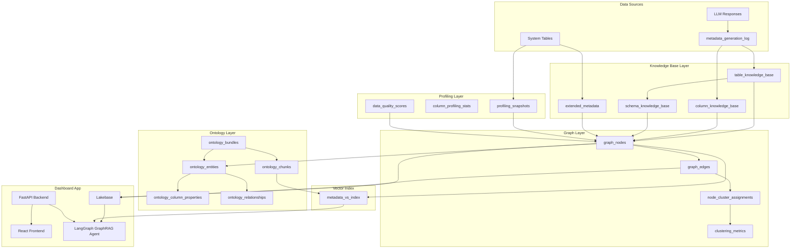

<p align="center">
  
</p>

# dbxmetagen: GenAI-Assisted Metadata Generation and Management for Databricks


**dbxmetagen** is an AI-powered toolkit for generating, managing, and analyzing metadata across Unity Catalog. It provides:

- **Comment generation**: AI-generated descriptions for tables and columns
- **PI classification**: Identify and tag PII, PHI, and PCI with Unity Catalog tags
- **Domain classification**: Categorize tables into business domains and subdomains
- **Data profiling**: Statistical profiling and quality scoring
- **Knowledge graph**: Graph-based metadata analytics with embeddings, similarity, and clustering
- **Ontology discovery**: Business entity extraction and validation against standard ontologies (FHIR, OMOP, etc.)
- **FK prediction**: AI-assisted foreign key relationship discovery using column similarity and LLM judgment
- **Semantic layer**: Auto-generated metric views and Genie space creation from knowledge base
- **Customer context**: Inject domain-specific knowledge into prompts, scoped by catalog/schema/table/pattern
- **Metadata review**: Interactive review, edit, and apply workflow for generated metadata
- **Web dashboard**: FastAPI + React app covering the full metadata lifecycle


The core value of dbxmetagen is **metadata generation and a governed knowledge graph**. The web dashboard manages the full lifecycle -- generate, review, and apply -- but the outputs are standard Delta tables and Vector Search indexes that you can consume from any tool: notebooks, dashboards, Genie spaces, agents, or your own applications.


## Quickstart

**Prerequisites:** Databricks CLI (>=0.283.0), Python 3.10+, [uv](https://docs.astral.sh/uv/) (for dependency management), Node.js (for frontend build), a Databricks workspace with Unity Catalog enabled, and a Foundation Model endpoint (e.g. `databricks-claude-sonnet-4-6`).

1. Clone the repo and configure:
   ```bash
   git clone https://github.com/databricks-industry-solutions/dbxmetagen
   cd dbxmetagen
   cp example.env dev.env   # Edit with your workspace URL, catalog, schema, warehouse_id
   ```

2. **Azure / GCP users:** The default job cluster node type is `i3.2xlarge` (AWS). Update `node_type` in `variables.yml` before deploying:
   - **Azure:** `Standard_DS4_v2`
   - **GCP:** `n2-highmem-8`

3. Deploy:
   ```bash
   ./deploy.sh --profile <your-profile> --target dev
   ```
   This builds the wheel, compiles the React frontend, deploys jobs + app via Asset Bundles, and starts the dashboard.

   To deploy jobs only (skip app build, SP detection, and app start):
   ```bash
   ./deploy.sh --profile <your-profile> --target dev --no-app
   ```

4. Access the app at **Workspace > Apps > dbxmetagen-app** and follow the instructions there.

## Partial Install (Notebook Only)

If you only need core metadata generation (comments, PI, domain) without the web dashboard, managed jobs, semantic layer, or Genie Builder, install the library directly on any Databricks cluster. No CLI, Asset Bundles, or repo clone needed.

### 1. Install

In a Databricks notebook cell:

```python
%pip install -qqq git+https://github.com/databricks-industry-solutions/dbxmetagen.git@main
dbutils.library.restartPython()
```

Or if you cloned the repo, install from local source:

```python
%pip install -qqq -r ../requirements.txt ..
dbutils.library.restartPython()
```

### 2. Generate metadata

```python
from dbxmetagen.main import main

main({
    "catalog_name": "my_catalog",
    "table_names": "my_catalog.my_schema.my_table",
    "mode": "comment",              # or "pi" or "domain"
    "schema_name": "metadata_results",
    "model": "databricks-claude-sonnet-4-6",
    "table_names_source": "parameter",
})
```

Use `"my_catalog.my_schema.*"` to process all tables in a schema.

### 3. Run analytics (optional)

After metadata generation, build the knowledge base and graph:

```python
from pyspark.sql import SparkSession
from dbxmetagen import build_knowledge_base, build_knowledge_graph, generate_embeddings, build_ontology

spark = SparkSession.builder.getOrCreate()
build_knowledge_base(spark, "my_catalog", "metadata_results")
build_knowledge_graph(spark, "my_catalog", "metadata_results")
generate_embeddings(spark, "my_catalog", "metadata_results")
build_ontology(spark, "my_catalog", "metadata_results")
```

The `examples/` notebooks show how to use dbxmetagen as a **standalone pip-installable library** -- useful for embedding into your own projects or quick ad-hoc runs. They install directly from GitHub and do not require cloning the repo or running `deploy.sh`. See the [examples README](examples/README.md) for details.

| Notebook | What it does |
|----------|-------------|
| `examples/01_generate_metadata.py` | Run all three modes (comment, PI, domain) for richest Genie context |
| `examples/02_build_knowledge_bases.py` | Structured KB tables from raw metadata |
| `examples/03_build_analytics.py` | Graph, ontology, embeddings, profiling, FK prediction, quality |
| `examples/04_generate_semantic_layer.py` | Metric view definitions from business questions |
| `examples/05_create_genie_spaces.py` | Genie spaces with auto-splitting for large schemas |

## Disclaimer

- AI-generated metadata must be human-reviewed for compliance.
- Generated comments may include data samples depending on settings.
- Compliance (e.g., HIPAA) is the user's responsibility.
- Unless configured otherwise, dbxmetagen sends data to the specified model endpoint.

## Architecture


```mermaid
flowchart TB
    subgraph sources [Data Sources]
        SYS[System Tables]
        LOG[metadata_generation_log]
        LLM[LLM Responses]
    end

    subgraph kb [Knowledge Base Layer]
        TKB[table_knowledge_base]
        CKB[column_knowledge_base]
        SKB[schema_knowledge_base]
        EXT[extended_metadata]
    end

    subgraph profiling [Profiling Layer]
        PROF[profiling_snapshots]
        CS[column_profiling_stats]
        DQ[data_quality_scores]
    end

    subgraph graph [Graph Layer]
        GN[graph_nodes]
        GE[graph_edges]
        NCA[node_cluster_assignments]
        CM[clustering_metrics]
    end

    subgraph ontology [Ontology Layer]
        ONT_CFG[ontology_bundles]
        ENT[ontology_entities]
        OCP[ontology_column_properties]
        ORL[ontology_relationships]
        OCH[ontology_chunks]
    end

    subgraph vector [Vector Index]
        VSI[metadata_vs_index]
    end

    subgraph app [Dashboard App]
        API[FastAPI Backend]
        UI[React Frontend]
        AGT[LangGraph GraphRAG Agent]
        LB[Lakebase]
    end

    SYS --> EXT
    SYS --> PROF
    LOG --> TKB
    LOG --> CKB
    TKB --> SKB
    LLM --> LOG

    TKB --> GN
    CKB --> GN
    SKB --> GN
    EXT --> GN
    PROF --> GN
    DQ --> GN

    GN --> GE
    GE --> NCA
    NCA --> CM

    ONT_CFG --> ENT
    ONT_CFG --> OCH
    GN --> ENT
    ENT --> OCP
    ENT --> ORL

    GN --> VSI
    OCH --> VSI

    GN --> LB
    GE --> LB
    LB --> AGT
    VSI --> AGT
    API --> AGT
    API --> UI
```

### Pipeline overview

dbxmetagen has two phases:

**Phase 1 -- Core metadata generation** (`generate_metadata.py` / `main()`):
- Runs one mode at a time: `comment`, `pi`, or `domain`
- Run comment mode first (or in parallel with PI + domain via `metadata_parallel_modes_job`) -- the analytics pipeline depends on all three modes having completed
- Writes results to `metadata_generation_log`
- Can apply DDL directly or output to files for review
- Each run re-processes all tables in scope (no incremental mode for generation)

**Phase 2 -- Analytics pipeline** (run after Phase 1):
- Aggregates log data into knowledge bases (table, column, schema)
- Builds a knowledge graph with nodes and edges
- Generates embeddings, discovers ontology entities, computes similarity
- Runs profiling, quality scoring, clustering, and FK prediction
- Supports incremental mode (`incremental=true`): each task checks upstream watermarks and skips if nothing changed

### Layers

| Layer | Tables | Purpose |
|-------|--------|---------|
| **Knowledge Base** | `table_knowledge_base`, `column_knowledge_base`, `schema_knowledge_base`, `extended_metadata` | Aggregated metadata from LLM outputs and system tables |
| **Profiling** | `profiling_snapshots`, `column_profiling_stats`, `data_quality_scores` | Statistical profiling and quality scoring |
| **Graph** | `graph_nodes`, `graph_edges`, `node_cluster_assignments`, `clustering_metrics`, `community_summaries` | Graph analytics with embeddings, similarity edges, K-means clustering, and AI-generated community summaries |
| **Ontology** | `ontology_entities`, `ontology_column_properties`, `ontology_relationships`, `ontology_chunks`, `ontology_metrics` | Business entity discovery, column classification, relationship detection, and vector retrieval |
| **Vector Index** | `metadata_vs_index`, `ontology_vs_index` | Hybrid semantic search over metadata documents and ontology entities. See [docs/CONFIGURATION.md](docs/CONFIGURATION.md#vector-search) |

All output tables are standard Delta tables in your output schema (`{catalog}.{schema_name}`), queryable via SQL, notebooks, or any tool that reads from Unity Catalog.

The ontology and graph system is inspired by semantic web standards (RDF, OWL, SHACL) but stores everything in Delta tables queryable via SQL. Industry bundles align with domain standards (FHIR, OMOP, Schema.org). See [docs/formal_semantics.md](docs/formal_semantics.md) for a detailed comparison.

## Human Review

Every pipeline step produces AI-generated output that should be reviewed before applying to Unity Catalog. By default, `apply_ddl=false` -- nothing touches your catalog until you explicitly review and apply.

Review guidance by step:

- **Comments**: spot-check 10-20% of descriptions, especially tables with domain-specific terminology
- **PI / PHI / PCI**: review ALL sensitivity classifications -- false negatives have compliance implications
- **Domain**: verify domain assignments match your business context
- **Ontology**: check entity mappings, especially those with confidence below 0.6
- **FK predictions**: approve correct predictions, reject false positives; use "Sync Knowledge Graph" after to propagate decisions
- **Metric views**: verify SQL expressions are valid and semantically correct before applying

The app's **Review & Apply** page is the primary review interface. The **Coverage** page tracks completeness across your schema.

## Interpreting Ontology Results

The ontology pipeline maps your tables and columns to business concepts defined in industry-standard bundles (FHIR, OMOP, Schema.org) or custom ontologies. Key output tables:

- **`ontology_entities`**: each row maps a table to a business concept (e.g., `dim_patient` -> `Patient`). The `confidence` column (0-1) reflects match certainty and `discovery_method` indicates whether it was keyword-based or LLM-classified. Review entities with confidence below 0.6.
- **`ontology_column_properties`**: assigns a `property_role` to each column in entity-mapped tables -- `primary_key`, `business_key`, `measure`, `dimension`, `temporal`, `geographic`, `label`, `audit`, or `object_property` (foreign reference).
- **`ontology_relationships`**: entity-to-entity relationships (e.g., `Encounter` references `Patient`) derived from FK predictions and column analysis.

See [docs/DOMAIN_ONTOLOGY_ARCHITECTURE.md](docs/DOMAIN_ONTOLOGY_ARCHITECTURE.md) for the full architecture and bundle comparison.

## Data Privacy

dbxmetagen sends the following to the configured LLM endpoint during metadata generation:

- Table and column names, data types, and schema structure (always)
- Sample row data (when `allow_data=true`, the default)

Set `allow_data=false` to prevent sample data from being sent; schema metadata is still sent. PII/PHI data values are never logged by the pipeline -- only metadata about detections (classification, type, confidence).

## Ontology Bundles and Deployment

Use **one ontology bundle per output schema**. This keeps entities, edges, column properties, and the vector index internally consistent.

If your data spans multiple domains (e.g., clinical + financial), deploy to **separate output schemas** per bundle:

- `catalog.metadata_clinical` with `ontology_bundle=fhir_r4`
- `catalog.metadata_financial` with `ontology_bundle=schema_org`

Switching `ontology_bundle` on the same schema between runs works but creates orphaned downstream data (stale docs, edges, embeddings). Clean up by enabling `sweep_stale_docs=true` and `sweep_stale_edges=true` on the next pipeline run, or see "Cleaning Up Previous Runs" below.

## Cleaning Up Previous Runs

Check edge counts by source system to diagnose graph issues:

```sql
SELECT source_system, COUNT(*) FROM {catalog}.{schema}.graph_edges GROUP BY 1;
```

Common cleanup scenarios:

- **Too many similarity edges**: delete and let the pipeline regenerate with ANN (the default):
  ```sql
  DELETE FROM {catalog}.{schema}.graph_edges WHERE source_system = 'embedding_similarity';
  ```
  Or re-run the analytics pipeline with `sweep_stale_edges=true`.
- **Orphaned ontology data after bundle switch**: enable "Sweep stale docs" in the Advanced Metadata tab (passes `sweep_stale_docs=true`) and run with `sweep_stale_edges=true`.
- **Full reset**: drop the output schema and re-deploy. The pipeline will recreate all tables.

## Scaling

Processing time depends on table count, column width, cluster size, and parallelism. Order-of-magnitude estimates for comment mode:

| Tables | Estimate | Recommended parallelism |
|--------|----------|------------------------|
| 10-100 | Minutes | 1 task (default) |
| 1,000-5,000 | Hours | 5-10 parallel tasks |
| 10,000-50,000 | Many hours to a day | 50+ parallel tasks |

Key tuning knobs: `columns_per_call` (default 20 -- higher reduces LLM calls for wide tables), `sample_size` (rows per prompt), and multi-task parallelism via the control table. Similarity edges use ANN by default (`use_ann=True`) to avoid quadratic scaling. See [docs/CONFIGURATION.md](docs/CONFIGURATION.md) for all parameters.

## API Reference

Core functions exported by the `dbxmetagen` package:

| Function | Description |
|----------|-------------|
| `main(kwargs)` | Entry point for metadata generation (comment/PI/domain) |
| `build_knowledge_base(spark, catalog, schema)` | Build table-level knowledge base from generation log |
| `build_column_knowledge_base(spark, catalog, schema)` | Build column-level knowledge base |
| `build_schema_knowledge_base(spark, catalog, schema)` | Build schema-level knowledge base |
| `extract_extended_metadata(spark, catalog, schema)` | Extract system metadata via DESCRIBE EXTENDED |
| `build_knowledge_graph(spark, catalog, schema)` | Build graph nodes and edges from KB tables |
| `generate_embeddings(spark, catalog, schema)` | Generate vector embeddings for graph nodes |
| `build_similarity_edges(spark, catalog, schema)` | Create similarity edges from embeddings |
| `build_ontology(spark, catalog, schema)` | Discover and store business entities |
| `validate_ontology(spark, catalog, schema)` | Validate discovered entities |
| `run_profiling(spark, catalog, schema)` | Profile tables and columns |
| `compute_data_quality(spark, catalog, schema)` | Compute data quality scores |
| `predict_foreign_keys(spark, catalog, schema)` | Predict FK relationships using AI + heuristics |
| `build_vector_index(spark, catalog, schema)` | Build or refresh Vector Search index over metadata |
| `build_genie_space(spark, catalog, schema)` | Create Genie space from knowledge base |
| `generate_semantic_layer(spark, catalog, schema)` | Generate metric view definitions |
| `classify_columns_geo(spark, catalog, schema)` | Geographic column classification |

## Notebooks

All notebooks live in `notebooks/`. The primary entry point is `generate_metadata.py` (used by all DAB jobs for comment, PI, and domain generation). Analytics notebooks (KB, graph, profiling, ontology, FK prediction, etc.) are orchestrated by the DAB pipeline jobs listed below.

## Configuration

### Quickstart (pip install)

When installed via pip, default configurations for domain classification and ontology are bundled in the wheel. Override by passing `domain_config_path` or `ontology_config_path` as kwargs.

### Full deployment (DAB)

Settings are in `variables.yml`. Key options:

| Setting | Default | Description |
|---------|---------|-------------|
| `catalog_name` | (required) | Unity Catalog name |
| `schema_name` | `metadata_results` | Output schema |
| `model` | `databricks-claude-sonnet-4-6` | LLM endpoint for generation |
| `mode` | `comment` | Generation mode: `comment`, `pi`, or `domain` |
| `apply_ddl` | `false` | Apply generated metadata directly to Unity Catalog |
| `allow_data` | `true` | Set `false` to prevent data from being sent to LLMs |
| `node_type` | `i3.2xlarge` | Job cluster node type. Change for Azure (`Standard_DS4_v2`) or GCP (`n2-highmem-8`) |
| `include_deterministic_pi` | `true` | Enable SpaCy/Presidio for rule-based PI detection (default model: `en_core_web_md`; set `spacy_model_names=en_core_web_lg` for higher accuracy -- see [Configuration docs](docs/CONFIGURATION.md)) |
| `federation_mode` | `false` | Enable for federated catalog sources (Redshift, Snowflake) |

For full reference, see [docs/CONFIGURATION.md](docs/CONFIGURATION.md).

**Customer Context**: inject domain-specific knowledge (glossaries, naming conventions, business rules) scoped by catalog/schema/table/pattern to improve generation quality. Manage context entries via the app's Generate Metadata page or YAML files in `configurations/customer_context/`.

## Dashboard App

The app is in `apps/dbxmetagen-app/` and provides a FastAPI backend with a React frontend. Deployed via DAB. Navigation is organized into three categories:

**Design:**
- **Generate Metadata** -- Trigger core (descriptions, sensitivity, domain) and advanced (ontology, FK, knowledge graph) jobs with model selection, Customer Context management
- **Define Metrics** -- Auto-generated metric views with SQL expression autofix, KPI Library grouped by Question Profile
- **Build Genie Space** -- Create and configure Genie spaces with auto-generated instructions and example SQL queries

**Review:**
- **Review & Apply** -- Browse, edit, approve, and apply generated metadata back to Unity Catalog
- **Coverage** -- Schema-wide metadata coverage summary and completeness metrics

**Explore:**
- **Agent** -- Deep analysis chat with GraphRAG, graph explorer, semantic search, and MLflow trace links
- **Entity Browser** -- Entity-first navigation with conformance view

**Permissions model:** The app uses two separate identities. The **app service principal** (SPN) controls what the app UI can *read* -- it needs SELECT on your catalog to browse tables, coverage, metadata, and graph data. The **deployer's identity** (the user who ran `deploy.sh`) controls what jobs can *write* -- jobs run as the deployer and need CREATE TABLE, ALTER TABLE, and SET TAGS on the target catalog. This means a user can see metadata in the app even if they don't have permission to generate or apply it, and conversely, the app SPN doesn't need write access to your tables. UC grants for the app SPN are applied automatically on every deploy. See [docs/PERMISSIONS.md](docs/PERMISSIONS.md) for the full permissions reference including OBO mode, Vector Search, and end-user access.

**Deep Analysis Agent:** Natural-language queries using a LangGraph GraphRAG pipeline that combines Vector Search retrieval, multi-hop graph traversal via Lakebase, FK/KB lookups, and LLM-generated data queries. Results include MLflow trace links for observability.

## Jobs

| Job Resource | Description |
|-------------|-------------|
| `metadata_generator_job` | Single-mode metadata generation (comment, PI, or domain) |
| `metadata_parallel_modes_job` | All 3 modes in parallel (comment first, then PI + domain) |
| `metadata_with_knowledge_base_job` | Metadata generation followed by KB + knowledge graph build |
| `full_analytics_pipeline_job` | Full pipeline: KB, graph, embeddings, profiling, ontology, similarity, clustering, FK prediction |
| `knowledge_base_builder_job` | Knowledge base and knowledge graph only |
| `ontology_prediction_job` | Ontology discovery and validation |
| `profiling_job` | Table profiling, quality scoring, and graph quality update |
| `fk_prediction_job` | Foreign key prediction with column similarity and AI judgment |
| `semantic_layer_job` | Generate metric views and apply to Genie spaces |
| `sync_graph_lakebase_job` | Sync graph data to Lakebase for the dashboard |
| `build_vector_index_job` | Rebuild the metadata vector search index (serverless). Deployed with a weekly schedule (Sun 02:00 UTC) but **paused by default** -- unpause in the Workflows UI to keep the index fresh automatically. Without it the index only updates on full pipeline runs or manual "Sync Vector Index" clicks in the app |
| `build_knowledge_graph_job` | Rebuild knowledge graph nodes and edges (serverless). Use after reviewing foreign keys to propagate approve/reject decisions without re-running the full pipeline |
| `sync_ddl_job` | Sync reviewed/edited DDL back to Unity Catalog |

## MCP Servers (Coming Soon)

> **Note:** MCP server support is under active development and not yet ready for production use.

dbxmetagen exposes its knowledge base, knowledge graph, and vector index as [Databricks Managed MCP servers](https://docs.databricks.com/aws/en/generative-ai/mcp). Any MCP-compatible client (Cursor, Claude Code, AI Playground) can query your metadata catalog directly. See [docs/MCP_SERVERS.md](docs/MCP_SERVERS.md) for client configuration, the full tool reference, and a walkthrough of how the dashboard's deep analysis agent uses these same data assets.

## Documentation

| Guide | Description |
|-------|-------------|
| [Configuration](docs/CONFIGURATION.md) | All runtime parameters, ontology bundles, Vector Search, Lakebase, OBO, and community summaries |
| [Permissions](docs/PERMISSIONS.md) | Two-identity model (app SPN vs job owner), UC grants, OBO mode, and end-user access |
| [Manual Deployment](docs/MANUAL_DEPLOYMENT.md) | Step-by-step deployment without `deploy.sh` (CLI-only or CI/CD) |
| [Domain & Ontology Architecture](docs/DOMAIN_ONTOLOGY_ARCHITECTURE.md) | Formal vs custom ontology bundles, domain YAML, and how they interact |
| [MCP Servers](docs/MCP_SERVERS.md) | Managed MCP server setup, tool reference, and agent integration |
| [QA Checklist](docs/QA_CHECKLIST.md) | Pre-release validation checklist |
| [Roadmap](docs/CONSOLIDATED_ROADMAP.md) | Open work items by theme and priority |
| [Dependencies](docs/DEPENDENCIES.md) | Third-party dependency inventory |

## Testing

```bash
uv sync                     # core deps (comment/domain modes)
uv sync --extra pi          # also install the spaCy model for PI dev
./run_tests.sh              # runs 3 test suites in isolated processes
./run_tests.sh -q           # quick mode (core tests only)

# Build and test wheel locally
uv build
pip install dist/*.whl
python -c "from dbxmetagen.config import MetadataConfig; print('OK')"
```

DDL regenerator and binary/variant tests must run in separate processes due to import conflicts -- `run_tests.sh` handles this automatically.

Requires DBR 14.3+ (ML runtime recommended for PI detection with spaCy). Serverless runtimes are supported for most operations.

## Troubleshooting

### `uv sync` fails with `invalid peer certificate: UnknownIssuer`

If you see an error like:

```
error: Request failed after 3 retries
  Caused by: invalid peer certificate: UnknownIssuer
```

This happens because `uv` uses `rustls` by default, which relies on a bundled certificate store rather than the system's native trust store. Corporate proxies and firewalls that inject their own CA certificates are not recognized.

**Fix:** tell `uv` to use the system's native TLS stack:

```bash
export UV_NATIVE_TLS=1
```

Add this to your shell profile (`~/.zshrc`, `~/.bashrc`, etc.) to make it permanent.

### `deploy.sh` hangs or fails at "Building frontend"

The deploy script runs `npm install` and `npm run build` to compile the React frontend. Common issues:

- **npm not installed:** Install Node.js (which includes npm) from https://nodejs.org/ or via `brew install node`.
- **npm registry unreachable:** Corporate firewalls or VPNs may block `registry.npmjs.org`. Check your network/proxy settings.
- **npm crashes ("Exit handler never called"):** This is a [known npm 11.x bug](https://github.com/npm/cli/issues). Fix by clearing the cache and retrying.
  If that doesn't help, downgrade npm: `npm install -g npm@10`

Then redeploy with `./deploy.sh`.

**Workaround:** The pre-built frontend (`apps/dbxmetagen-app/app/src/dist/`) is committed to the repo, so you can skip the build entirely if you haven't changed any frontend code:

```bash
./deploy.sh --profile <your-profile> --target dev --no-frontend
```

### Jobs fail with "Instance type not supported" or "NODE_TYPE_NOT_SUPPORTED"

The default `node_type` in `variables.yml` is `i3.2xlarge`, which is an AWS instance type. If you're running on Azure or GCP, job clusters will fail to start.

**Fix:** Update `node_type` in `variables.yml` to match your cloud:

| Cloud | Recommended `node_type` |
|-------|------------------------|
| AWS   | `i3.2xlarge` (default) |
| Azure | `Standard_DS4_v2`      |
| GCP   | `n2-highmem-8`         |

You may need to try a couple different node types if your organization doesn't have capacity for these in your cloud.

## Dependencies

All packages use permissive licenses (Apache 2.0, MIT, BSD, PSF). See [docs/DEPENDENCIES.md](docs/DEPENDENCIES.md) for the full package analysis.

## License

This project is licensed under the Databricks DB License.

## Acknowledgements

Thanks to James McCall, Diego Malaver, Aaron Zavora, and Charles Linville for discussions around dbxmetagen.
