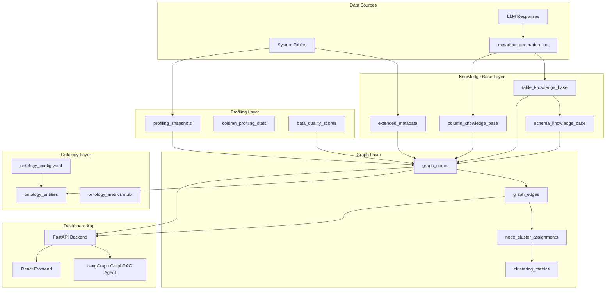

# dbxmetagen: GenAI-Assisted Metadata Generation and Management for Databricks


**dbxmetagen** is an AI-powered toolkit for generating, managing, and analyzing metadata across Unity Catalog. It provides:

- **Comment generation**: AI-generated descriptions for tables and columns
- **PI classification**: Identify and tag PII, PHI, and PCI with Unity Catalog tags
- **Domain classification**: Categorize tables into business domains and subdomains
- **Data profiling**: Statistical profiling and quality scoring
- **Knowledge graph**: Graph-based metadata analytics with embeddings, similarity, and clustering
- **Ontology discovery**: Business entity extraction and validation
- **Web dashboard**: FastAPI + React app for metadata review, profiling, and graph exploration

## Quickstart

1. **Clone the repo** into a Git Folder in your Databricks workspace
   ```
   Create Git Folder -> Clone https://github.com/databricks-industry-solutions/dbxmetagen
   ```

2. **Open the notebook**: `notebooks/generate_metadata.py`

3. **Fill in the widgets**:
   - **catalog_name** (required): Your Unity Catalog name
   - **table_names** (required): Comma-separated list (e.g., `catalog.schema.table1`). Use `catalog.schema.*` for all tables in a schema.
   - **mode**: Choose `comment`, `pi`, or `domain`

4. **Run the notebook** -- metadata is generated and logged. Set `apply_ddl=true` to apply changes to Unity Catalog.

### pip install

dbxmetagen is pip-installable:

```bash
pip install dbxmetagen              # Core (no SpaCy/Presidio)
pip install dbxmetagen[nlp]         # With SpaCy + Presidio for deterministic PI detection
```

### Full Deployment (DAB)

For the web dashboard, batch jobs, and full pipeline:

1. Install prerequisites: Databricks CLI, Python 3.10+, Poetry
2. Configure:
   ```bash
   cp example.env dev.env  # Edit with your workspace URL and catalog/schema
   ```
   For the dashboard app to show metadata and metrics, set `catalog_name` and (optionally) `schema_name` in dev.env; deploy.sh injects these into the bundle so the app gets the correct CATALOG_NAME/SCHEMA_NAME at runtime.
3. Deploy:
   ```bash
   ./deploy.sh --profile <your-profile> --target <your-dab-target>
   ```
4. Access the app at **Workspace -> Apps -> dbxmetagen-app**

Or run jobs directly:
```bash
databricks bundle run metadata_generator_job -t <target> -p <profile> --params table_names='catalog.schema.*',mode=domain
databricks bundle run metadata_parallel_modes_job -t <target> -p <profile> --params table_names='catalog.schema.*'
```

## Disclaimer

- AI-generated metadata must be human-reviewed for compliance.
- Generated comments may include data samples depending on settings.
- Compliance (e.g., HIPAA) is the user's responsibility.
- Unless configured otherwise, dbxmetagen sends data to the specified model endpoint.

## Architecture


```mermaid
flowchart TB
    subgraph sources [Data Sources]
        SYS[System Tables]
        LOG[metadata_generation_log]
        LLM[LLM Responses]
    end

    subgraph kb [Knowledge Base Layer]
        TKB[table_knowledge_base]
        CKB[column_knowledge_base]
        SKB[schema_knowledge_base]
        EXT[extended_metadata]
    end

    subgraph profiling [Profiling Layer]
        PROF[profiling_snapshots]
        CS[column_profiling_stats]
        DQ[data_quality_scores]
    end

    subgraph graph [Graph Layer]
        GN[graph_nodes]
        GE[graph_edges]
        NCA[node_cluster_assignments]
        CM[clustering_metrics]
    end

    subgraph ontology [Ontology Layer]
        ONT_CFG[ontology_config.yaml]
        ENT[ontology_entities]
        MET[ontology_metrics stub]
    end

    subgraph app [Dashboard App]
        API[FastAPI Backend]
        UI[React Frontend]
        AGT[LangGraph GraphRAG Agent]
    end

    SYS --> EXT
    SYS --> PROF
    LOG --> TKB
    LOG --> CKB
    TKB --> SKB
    LLM --> LOG

    TKB --> GN
    CKB --> GN
    SKB --> GN
    EXT --> GN
    PROF --> GN
    DQ --> GN

    GN --> GE
    GE --> NCA
    NCA --> CM

    ONT_CFG --> ENT
    GN --> ENT

    GN --> API
    GE --> API
    API --> AGT
    API --> UI
```

### Layers

| Layer | Tables | Purpose |
|-------|--------|---------|
| **Knowledge Base** | `table_knowledge_base`, `column_knowledge_base`, `schema_knowledge_base`, `extended_metadata` | Aggregated metadata from LLM outputs and system tables |
| **Profiling** | `profiling_snapshots`, `column_profiling_stats`, `data_quality_scores` | Statistical profiling and quality scoring |
| **Graph** | `graph_nodes`, `graph_edges`, `node_cluster_assignments`, `clustering_metrics` | Graph analytics with embeddings, similarity edges, and K-means clustering |
| **Ontology** | `ontology_entities`, `ontology_metrics` (stub) | Business entity discovery and validation |

## Notebooks

| Notebook | Purpose |
|----------|---------|
| `generate_metadata.py` | Primary entry point: comment, PI, and domain generation |
| `sync_reviewed_ddl.py` | Re-apply reviewed/edited metadata from TSV or Excel |
| `build_knowledge_base.py` | Build table + column knowledge base tables |
| `build_column_kb.py` | Build column-level knowledge base |
| `build_schema_kb.py` | Build schema-level knowledge base |
| `extract_extended_metadata.py` | Extract system metadata via DESCRIBE EXTENDED |
| `run_profiling.py` | Profile tables and columns |
| `compute_data_quality.py` | Compute data quality scores |
| `build_knowledge_graph.py` | Build graph nodes and edges |
| `generate_embeddings.py` | Generate node embeddings |
| `build_similarity_edges.py` | Build similarity edges from embeddings |
| `build_ontology.py` | Discover and store ontology entities |
| `validate_ontology.py` | Validate ontology entities |
| `cluster_analysis.py` | K-means clustering with multi-phase optimization |

## Configuration

Most settings are in `variables.yml`. Key options:

| Setting | Default | Description |
|---------|---------|-------------|
| `allow_data` | `true` | Set `false` to prevent data from being sent to LLMs |
| `apply_ddl` | `false` | Apply generated metadata directly to Unity Catalog |
| `model` | `databricks-claude-sonnet-4-5` | LLM endpoint for generation |
| `mode` | `comment` | Generation mode: `comment`, `pi`, or `domain` |
| `federation_mode` | `false` | Enable for federated catalog sources (Redshift, Snowflake) |
| `include_deterministic_pi` | `false` | Enable SpaCy/Presidio for rule-based PI detection |

For full reference, see [docs/CONFIGURATION.md](docs/CONFIGURATION.md).

## Federation Mode

When `federation_mode=true`, dbxmetagen adapts for federated catalogs in Unity Catalog:

| Feature | Status | Notes |
|---------|--------|-------|
| SELECT / spark.read.table | Works | Standard reads via federation |
| DESCRIBE TABLE | Works | Basic column info available |
| SHOW TABLES IN | Works | Schema listing via federation |
| DESCRIBE DETAIL | Skipped | Delta-specific (sizeInBytes, numFiles) |
| DESCRIBE EXTENDED | Skipped | May return limited metadata |
| ALTER TABLE / COMMENT ON | Skipped | Cannot modify federated tables |
| SET TAGS / UNSET TAGS | Skipped | Cannot tag federated tables |
| AI_QUERY() | Works | Databricks SQL function |
| Output tables (MERGE, saveAsTable) | Works | Output tables are Delta |

Federation mode forces `apply_ddl=false` since DDL cannot be applied to federated source tables. All dbxmetagen output tables remain Delta.

## Dashboard App

The app is in `apps/dbxmetagen-app/` and provides a FastAPI backend with a React frontend:

**Tabs:**
1. **Batch Jobs** -- Trigger and monitor metadata generation, parallel modes, and full analytics pipeline
2. **Metadata Review** -- Browse generation log, knowledge base tables, filter by table name
3. **Data Profiling** -- Profiling snapshots, column statistics, quality scores
4. **Ontology** -- Entity type summary, discovered entities, validation status
5. **Analytics & Graph** -- Clustering results, similarity edges, GraphRAG query interface

**GraphRAG:** Natural-language queries against the knowledge graph using a LangGraph agent that iteratively traverses graph_nodes and graph_edges. Supports both Lakebase GraphQL (when available) and SQL fallback.

Deploy via DAB:
```bash
./deploy.sh --profile <profile> --target <target>
```

## Domain Classification

Categorizes tables into business domains by analyzing table metadata. Configured via `configurations/domain_config.yaml`.

Default domains: Finance, Clinical, CRM, HR, Operations, Marketing, Product, IT, Legal. Customize by editing the YAML file.

## Jobs

| Job Resource | Description |
|-------------|-------------|
| `metadata_generator_job` | Single-mode metadata generation |
| `metadata_parallel_modes_job` | All 3 modes (comment, pi, domain) in parallel |
| `full_analytics_pipeline` | Knowledge base -> profiling -> graph -> embeddings -> clustering |
| `ontology_job` | Ontology discovery and validation |
| `profiling_job` | Table profiling and quality scoring |

## Testing

```bash
# Unit tests
pytest -v

# Integration tests (requires Databricks cluster)
# Run notebooks in notebooks/integration_tests/ via DAB or cluster

# Build and test wheel
poetry build && pip install dist/*.whl
python -c "from dbxmetagen.config import MetadataConfig; print('OK')"
```

## Current Status

- Tested on DBR 17.4 LTS, 16.4 LTS, 15.4 LTS (and ML variants)
- Serverless runtimes tested but less consistent
- Views only work on 16.4+
- Excel writes require ML runtimes; use TSV on standard runtimes

## Analysis of Packages Used

| Package | License | Source |
|---------|---------|--------|
| mlflow | Apache 2.0 | https://github.com/mlflow/mlflow |
| openai | Apache 2.0 | https://github.com/openai/openai-python |
| cloudpickle | BSD 3-Clause | https://github.com/cloudpipe/cloudpickle |
| pydantic | MIT | https://github.com/pydantic/pydantic |
| ydata-profiling | MIT | https://github.com/ydataai/ydata-profiling |
| databricks-langchain | Apache 2.0 | https://github.com/databricks/databricks-ai-bridge |
| databricks-sdk | Apache 2.0 | https://github.com/databricks/databricks-sdk-py |
| openpyxl | MIT | https://foss.heptapod.net/openpyxl/openpyxl |
| spacy (optional) | MIT | https://spacy.io |
| presidio-analyzer (optional) | MIT | https://github.com/microsoft/presidio |
| fastapi | MIT | https://github.com/tiangolo/fastapi |
| langgraph | MIT | https://github.com/langchain-ai/langgraph |
| pyyaml | MIT | https://pypi.org/project/PyYAML/ |
| requests | Apache 2.0 | https://github.com/psf/requests |

All packages use permissive licenses (Apache 2.0, MIT, BSD 3-Clause).

## License

This project is licensed under the Databricks DB License.

## Acknowledgements

Thanks to James McCall, Diego Malaver, Aaron Zavora, and Charles Linville for discussions around dbxmetagen.

For detailed configuration options, see [docs/CONFIGURATION.md](docs/CONFIGURATION.md).

For user workflows and team roles, see [docs/PERSONAS_AND_WORKFLOWS.md](docs/PERSONAS_AND_WORKFLOWS.md).
