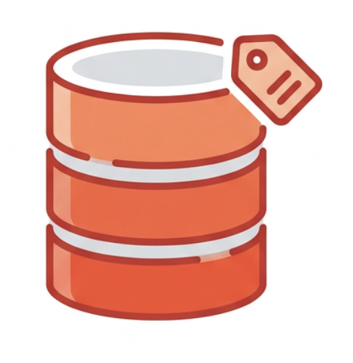
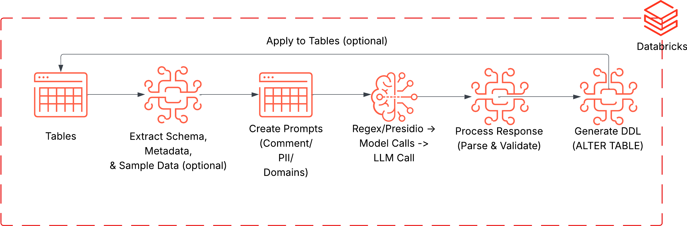
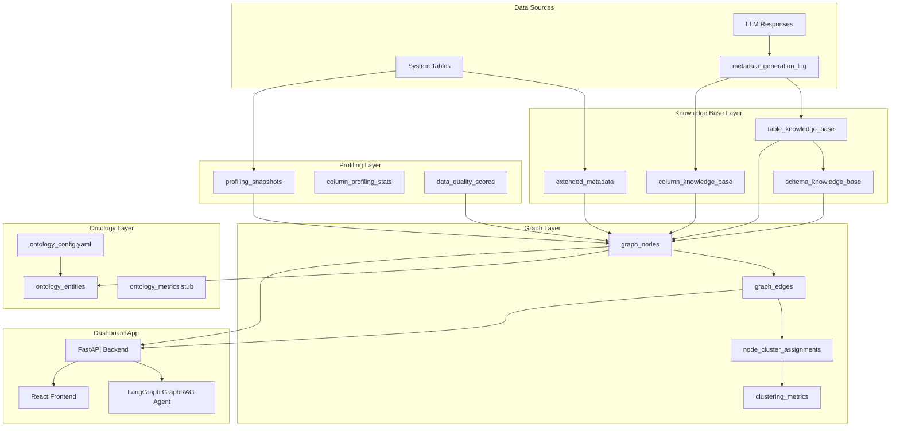

<p align="center">
  
</p>

# dbxmetagen: GenAI-Assisted Metadata Generation and Management for Databricks



**dbxmetagen** is an AI-powered toolkit for generating, managing, and analyzing metadata across Unity Catalog. It provides:

- **Comment generation**: AI-generated descriptions for tables and columns
- **PI classification**: Identify and tag PII, PHI, and PCI with Unity Catalog tags
- **Domain classification**: Categorize tables into business domains and subdomains
- **Data profiling**: Statistical profiling and quality scoring
- **Knowledge graph**: Graph-based metadata analytics with embeddings, similarity, and clustering
- **Ontology discovery**: Business entity extraction and validation against standard ontologies (FHIR, OMOP, etc.)
- **FK prediction**: AI-assisted foreign key relationship discovery using column similarity and LLM judgment
- **Semantic layer**: Auto-generated metric views and Genie space creation from knowledge base
- **Metadata review**: Interactive review, edit, and apply workflow for generated metadata
- **Web dashboard**: FastAPI + React app with 8 tabs covering the full metadata lifecycle

> **Note:** This project recently migrated from Poetry to [uv](https://docs.astral.sh/uv/) for dependency management. If you have an existing clone that used Poetry, remove any old `poetry.lock` and virtual environments, then run `uv sync` to set up a fresh environment.

## Quickstart

**Prerequisites:** Databricks CLI (>=0.283.0), Python 3.10+, [uv](https://docs.astral.sh/uv/) (for dependency management), Node.js (for frontend build), a Databricks workspace with Unity Catalog enabled and a Foundation Model endpoint (e.g. `databricks-claude-sonnet-4-6`).

1. Clone the repo and configure:
   ```bash
   git clone https://github.com/databricks-industry-solutions/dbxmetagen
   cd dbxmetagen
   cp example.env dev.env   # Edit with your workspace URL, catalog, schema, warehouse_id
   ```

2. Deploy:
   ```bash
   ./deploy.sh --profile <your-profile> --target dev
   ```
   This builds the wheel, compiles the React frontend, deploys jobs + app via Asset Bundles, and starts the dashboard.

   To deploy jobs only (skip app build, SP detection, and app start):
   ```bash
   ./deploy.sh --profile <your-profile> --target dev --no-app
   ```

3. Access the app at **Workspace > Apps > dbxmetagen-app**

4. Run jobs:
   ```bash
   databricks bundle run metadata_generator_job -t dev -p <profile> --params table_names='catalog.schema.*',mode=domain
   databricks bundle run full_analytics_pipeline_job -t dev -p <profile>
   ```

## Partial Install (Notebook Only)

If you only need core metadata generation (comments, PI, domain) without the web dashboard, managed jobs, semantic layer, or Genie Builder, install the library directly on any Databricks cluster. No CLI, Asset Bundles, or repo clone needed.

### 1. Install

In a Databricks notebook cell:

```python
%pip install -qqq git+https://github.com/databricks-industry-solutions/dbxmetagen.git@main
dbutils.library.restartPython()
```

Or if you cloned the repo, install from local source:

```python
%pip install -qqq -r ../requirements.txt ..
dbutils.library.restartPython()
```

### 2. Generate metadata

```python
from dbxmetagen.main import main

main({
    "catalog_name": "my_catalog",
    "table_names": "my_catalog.my_schema.my_table",
    "mode": "comment",              # or "pi" or "domain"
    "schema_name": "metadata_results",
    "model": "databricks-claude-sonnet-4-6",
    "table_names_source": "parameter",
})
```

Use `"my_catalog.my_schema.*"` to process all tables in a schema.

### 3. Run analytics (optional)

After metadata generation, build the knowledge base and graph:

```python
from pyspark.sql import SparkSession
from dbxmetagen import build_knowledge_base, build_knowledge_graph, generate_embeddings, build_ontology

spark = SparkSession.builder.getOrCreate()
build_knowledge_base(spark, "my_catalog", "metadata_results")
build_knowledge_graph(spark, "my_catalog", "metadata_results")
generate_embeddings(spark, "my_catalog", "metadata_results")
build_ontology(spark, "my_catalog", "metadata_results")
```

The `examples/` notebooks show how to use dbxmetagen as a **standalone pip-installable library** -- useful for embedding into your own projects or quick ad-hoc runs. They install directly from GitHub and do not require cloning the repo or running `deploy.sh`. See the [examples README](examples/README.md) for details.

| Notebook | What it does |
|----------|-------------|
| `examples/01_quickstart_metadata.py` | Comment, PI, or domain generation with widgets |
| `examples/02_analytics_pipeline.py` | Full KB, graph, embeddings, ontology, similarity, quality pipeline |
| `examples/03_advanced_analytics.py` | FK prediction and ontology validation |

## Disclaimer

- AI-generated metadata must be human-reviewed for compliance.
- Generated comments may include data samples depending on settings.
- Compliance (e.g., HIPAA) is the user's responsibility.
- Unless configured otherwise, dbxmetagen sends data to the specified model endpoint.

## Architecture


```mermaid
flowchart TB
    subgraph sources [Data Sources]
        SYS[System Tables]
        LOG[metadata_generation_log]
        LLM[LLM Responses]
    end

    subgraph kb [Knowledge Base Layer]
        TKB[table_knowledge_base]
        CKB[column_knowledge_base]
        SKB[schema_knowledge_base]
        EXT[extended_metadata]
    end

    subgraph profiling [Profiling Layer]
        PROF[profiling_snapshots]
        CS[column_profiling_stats]
        DQ[data_quality_scores]
    end

    subgraph graph [Graph Layer]
        GN[graph_nodes]
        GE[graph_edges]
        NCA[node_cluster_assignments]
        CM[clustering_metrics]
    end

    subgraph ontology [Ontology Layer]
        ONT_CFG[ontology_config.yaml]
        ENT[ontology_entities]
        MET[ontology_metrics stub]
    end

    subgraph app [Dashboard App]
        API[FastAPI Backend]
        UI[React Frontend]
        AGT[LangGraph GraphRAG Agent]
    end

    SYS --> EXT
    SYS --> PROF
    LOG --> TKB
    LOG --> CKB
    TKB --> SKB
    LLM --> LOG

    TKB --> GN
    CKB --> GN
    SKB --> GN
    EXT --> GN
    PROF --> GN
    DQ --> GN

    GN --> GE
    GE --> NCA
    NCA --> CM

    ONT_CFG --> ENT
    GN --> ENT

    GN --> API
    GE --> API
    API --> AGT
    API --> UI
```

### Pipeline overview

dbxmetagen has two phases:

**Phase 1 -- Core metadata generation** (`generate_metadata.py` / `main()`):
- Runs one mode at a time: `comment`, `pi`, or `domain`
- Writes results to `metadata_generation_log`
- Can apply DDL directly or output to files for review

**Phase 2 -- Analytics pipeline** (run after Phase 1):
- Aggregates log data into knowledge bases (table, column, schema)
- Builds a knowledge graph with nodes and edges
- Generates embeddings, discovers ontology entities, computes similarity
- Runs profiling, quality scoring, clustering, and FK prediction

### Layers

| Layer | Tables | Purpose |
|-------|--------|---------|
| **Knowledge Base** | `table_knowledge_base`, `column_knowledge_base`, `schema_knowledge_base`, `extended_metadata` | Aggregated metadata from LLM outputs and system tables |
| **Profiling** | `profiling_snapshots`, `column_profiling_stats`, `data_quality_scores` | Statistical profiling and quality scoring |
| **Graph** | `graph_nodes`, `graph_edges`, `node_cluster_assignments`, `clustering_metrics` | Graph analytics with embeddings, similarity edges, and K-means clustering |
| **Ontology** | `ontology_entities`, `ontology_metrics` (stub) | Business entity discovery and validation |

### Relationship to semantic web standards

dbxmetagen's ontology and graph system is inspired by — but does not implement — formal semantic web standards. Here's an honest comparison:

| Standard | What it does | How dbxmetagen relates |
|----------|-------------|----------------------|
| **RDF** (triples: subject, predicate, object) | Standard data model for knowledge graphs | `graph_nodes` + `graph_edges` stores triples in Delta tables — nodes have types and properties, edges have labels, direction, and confidence. Functionally similar but SQL-queryable, not a triple store. No RDF serialization on the read or write path. |
| **OWL** (Web Ontology Language) | Formal class hierarchies with automated reasoning | Ontology bundles define entity types with keywords, typed properties, and `parent` (subclass_of) relationships. Discovery uses LLM classification + keyword matching, not a formal OWL reasoner. Bundles are YAML, not OWL — simpler to author but without automated inference or transitive closure. |
| **SHACL** (Shapes Constraint Language) | Validates graph data against declared shapes | `validate_ontology_completeness()` checks that discovered entity types cover the bundle's defined types. `validate_entity_conformance()` checks whether discovered column properties match the bundle's declared property schema. Similar in purpose to SHACL but implemented as Python/SQL checks, not a constraint language. |
| **SPARQL** (Semantic query language) | Query language for RDF graphs | All graph queries use SQL against Delta tables. The GraphRAG agent and Graph Explorer traverse `graph_nodes`/`graph_edges` via SQL joins. Vector search is used for semantic metadata retrieval (finding relevant docs/tables), not for graph traversal. |

Industry bundles (`healthcare.yaml`, `financial_services.yaml`) use entity names aligned with domain standards (e.g., FHIR Patient, OMOP CONDITION_OCCURRENCE) but don't import OWL/RDF files. A JSON-LD export endpoint (`/api/ontology/export`) provides basic Schema.org interoperability. The design is pragmatic: all consumers speak SQL natively, so a triple store would add infrastructure without benefiting the primary use case.

## API Reference

Core functions exported by the `dbxmetagen` package:

| Function | Description |
|----------|-------------|
| `main(kwargs)` | Entry point for metadata generation (comment/PI/domain) |
| `build_knowledge_base(spark, catalog, schema)` | Build table-level knowledge base from generation log |
| `build_column_knowledge_base(spark, catalog, schema)` | Build column-level knowledge base |
| `build_schema_knowledge_base(spark, catalog, schema)` | Build schema-level knowledge base |
| `extract_extended_metadata(spark, catalog, schema)` | Extract system metadata via DESCRIBE EXTENDED |
| `build_knowledge_graph(spark, catalog, schema)` | Build graph nodes and edges from KB tables |
| `generate_embeddings(spark, catalog, schema)` | Generate vector embeddings for graph nodes |
| `build_similarity_edges(spark, catalog, schema)` | Create similarity edges from embeddings |
| `build_ontology(spark, catalog, schema)` | Discover and store business entities |
| `validate_ontology(spark, catalog, schema)` | Validate discovered entities |
| `run_profiling(spark, catalog, schema)` | Profile tables and columns |
| `compute_data_quality(spark, catalog, schema)` | Compute data quality scores |
| `predict_foreign_keys(spark, catalog, schema)` | Predict FK relationships using AI + heuristics |

## Notebooks

All notebooks live in `notebooks/`. The primary entry point is `generate_metadata.py` (used by all DAB jobs for comment, PI, and domain generation). Analytics notebooks (KB, graph, profiling, ontology, FK prediction, etc.) are orchestrated by the DAB pipeline jobs listed below.

## Configuration

### Quickstart (pip install)

When installed via pip, default configurations for domain classification and ontology are bundled in the wheel. Override by passing `domain_config_path` or `ontology_config_path` as kwargs.

### Full deployment (DAB)

Settings are in `variables.yml`. Key options:

| Setting | Default | Description |
|---------|---------|-------------|
| `catalog_name` | (required) | Unity Catalog name |
| `schema_name` | `metadata_results` | Output schema |
| `model` | `databricks-claude-sonnet-4-6` | LLM endpoint for generation |
| `mode` | `comment` | Generation mode: `comment`, `pi`, or `domain` |
| `apply_ddl` | `false` | Apply generated metadata directly to Unity Catalog |
| `allow_data` | `true` | Set `false` to prevent data from being sent to LLMs |
| `include_deterministic_pi` | `true` | Enable SpaCy/Presidio for rule-based PI detection (requires `en_core_web_lg` model -- see [Configuration docs](docs/CONFIGURATION.md)) |
| `federation_mode` | `false` | Enable for federated catalog sources (Redshift, Snowflake) |

For full reference, see [docs/CONFIGURATION.md](docs/CONFIGURATION.md).

## Domain Classification

Categorizes tables into business domains using a two-stage LLM pipeline: keyword pre-filter, then domain classification, then subdomain classification. Configured via `configurations/domain_config.yaml`.

**12 default domains** (aligned with DAMA DMBOK, FHIR, OMOP): clinical, diagnostics, payer, pharmaceutical, quality_safety, research, finance, operations, workforce, customer, technology, governance. Each domain includes subdomains with keywords and descriptions -- see the YAML config for details.

Customize domains and subdomains by editing the YAML file or providing your own via `domain_config_path`.

## Federation Mode

When `federation_mode=true`, dbxmetagen adapts for federated catalogs in Unity Catalog:

| Feature | Status | Notes |
|---------|--------|-------|
| SELECT / spark.read.table | Works | Standard reads via federation |
| DESCRIBE TABLE | Works | Basic column info available |
| SHOW TABLES IN | Works | Schema listing via federation |
| DESCRIBE DETAIL | Skipped | Delta-specific |
| DESCRIBE EXTENDED | Skipped | May return limited metadata |
| ALTER TABLE / COMMENT ON | Skipped | Cannot modify federated tables |
| SET TAGS / UNSET TAGS | Skipped | Cannot tag federated tables |
| Output tables | Works | All output tables are Delta |

## Dashboard App

The app is in `apps/dbxmetagen-app/` and provides a FastAPI backend with a React frontend. Deployed via DAB. Batch jobs support model selection between `databricks-claude-sonnet-4-6` and `databricks-gpt-oss-120b`.

**Tabs:**
1. **Semantic Layer** (landing page) -- Auto-generated metric views with SQL expression autofix, KPI Library grouped by Question Profile, and Genie space creation
2. **Coverage** -- Schema-wide metadata coverage summary and completeness metrics
3. **Batch Jobs** -- Trigger and monitor all metadata generation, analytics, and sync jobs with real-time status and model selection
4. **Metadata Review** -- Browse, edit, approve, and apply generated metadata back to Unity Catalog
5. **Ontology** -- Entity type summary, discovered entities, validation status
6. **Graph Explorer** -- Browse graph nodes, filter by type, query the GraphRAG agent
7. **Foreign Key Generation** -- AI-predicted FK relationships with confidence scores and approval workflow
8. **Genie Builder** -- Create and configure Genie spaces with auto-generated instructions and ~10 example SQL queries

**GraphRAG:** Natural-language queries against the knowledge graph using a LangGraph agent that traverses graph_nodes and graph_edges via Lakebase.

## Jobs

| Job Resource | Description |
|-------------|-------------|
| `metadata_generator_job` | Single-mode metadata generation (comment, PI, or domain) |
| `metadata_parallel_modes_job` | All 3 modes in parallel (comment first, then PI + domain) |
| `metadata_with_knowledge_base_job` | Metadata generation followed by KB + knowledge graph build |
| `full_analytics_pipeline_job` | Full pipeline: KB, graph, embeddings, profiling, ontology, similarity, clustering, FK prediction |
| `knowledge_base_builder_job` | Knowledge base and knowledge graph only |
| `ontology_prediction_job` | Ontology discovery and validation |
| `profiling_job` | Table profiling, quality scoring, and graph quality update |
| `fk_prediction_job` | Foreign key prediction with column similarity and AI judgment |
| `semantic_layer_job` | Generate metric views and apply to Genie spaces |
| `sync_graph_lakebase_job` | Sync graph data to Lakebase for the dashboard |
| `sync_ddl_job` | Sync reviewed/edited DDL back to Unity Catalog |

## Testing

```bash
uv sync                     # core deps (comment/domain modes)
uv sync --extra pi          # also install the spaCy model for PI dev
uv run pytest -v

# Build and test wheel locally
uv build
pip install dist/*.whl
python -c "from dbxmetagen.config import MetadataConfig; print('OK')"
```

Wheels are built automatically by CI on tagged releases (see `.github/workflows/release.yml`).

Requires DBR 17.3+ (ML runtime recommended). Serverless runtimes are supported for most operations.

## Troubleshooting

### `uv sync` fails with `invalid peer certificate: UnknownIssuer`

If you see an error like:

```
error: Request failed after 3 retries
  Caused by: invalid peer certificate: UnknownIssuer
```

This happens because `uv` uses `rustls` by default, which relies on a bundled certificate store rather than the system's native trust store. Corporate proxies and firewalls that inject their own CA certificates are not recognized.

**Fix:** tell `uv` to use the system's native TLS stack:

```bash
export UV_NATIVE_TLS=1
```

Add this to your shell profile (`~/.zshrc`, `~/.bashrc`, etc.) to make it permanent.

## Analysis of Packages Used

### Python (direct dependencies from pyproject.toml)

| Package | Version | License | Source |
|---------|---------|---------|--------|
| mlflow | 3.6.0 | Apache 2.0 | https://github.com/mlflow/mlflow |
| openai | 1.56.1 | Apache 2.0 | https://github.com/openai/openai-python |
| cloudpickle | 3.1.0 | BSD 3-Clause | https://github.com/cloudpipe/cloudpickle |
| pydantic | 2.10.3 | MIT | https://github.com/pydantic/pydantic |
| ydata-profiling | 4.17.0 | MIT | https://github.com/ydataai/ydata-profiling |
| databricks-langchain | 0.4.0 | Databricks License | https://github.com/databricks/databricks-ai-bridge |
| databricks-sdk | 0.68.0 | Apache 2.0 | https://github.com/databricks/databricks-sdk-py |
| openpyxl | 3.1.5 | MIT | https://foss.heptapod.net/openpyxl/openpyxl |
| spacy | 3.8.7 | MIT | https://spacy.io |
| presidio-analyzer | 2.2.358 | MIT | https://github.com/microsoft/presidio |
| deprecated | 1.2.13 | MIT | https://github.com/tantale/deprecated |
| pyyaml | 6.0.1 | MIT | https://pypi.org/project/PyYAML/ |
| requests | 2.32.5 | Apache 2.0 | https://github.com/psf/requests |
| nest-asyncio | 1.6.0 | BSD 2-Clause | https://github.com/erdewit/nest_asyncio |

### Python (key transitive dependencies used by the app/agent)

| Package | Version | License | Source |
|---------|---------|---------|--------|
| fastapi | 0.135.1 | MIT | https://github.com/tiangolo/fastapi |
| langgraph | 1.1.3 | MIT | https://github.com/langchain-ai/langgraph |
| langchain | 1.2.13 | MIT | https://github.com/langchain-ai/langchain |
| langchain-community | 0.4.1 | MIT | https://github.com/langchain-ai/langchain |
| databricks-vectorsearch | 0.66 | DB License | https://pypi.org/project/databricks-vectorsearch/ |
| databricks-connect | -- | Databricks Proprietary | https://pypi.org/project/databricks-connect/ |
| grpcio | 1.78.0 | Apache 2.0 | https://github.com/grpc/grpc |
| uvicorn | 0.42.0 | BSD 3-Clause | https://github.com/encode/uvicorn |
| tiktoken | 0.12.0 | MIT | https://github.com/openai/tiktoken |
| scikit-learn | 1.8.0 | BSD 3-Clause | https://github.com/scikit-learn/scikit-learn |
| numpy | 2.1.3 | BSD 3-Clause | https://github.com/numpy/numpy |
| pandas | 2.3.3 | BSD 3-Clause | https://github.com/pandas-dev/pandas |
| scipy | 1.15.3 | BSD 3-Clause | https://github.com/scipy/scipy |
| matplotlib | 3.10.0 | PSF | https://github.com/matplotlib/matplotlib |

### JavaScript (frontend)

| Package | Version | License | Source |
|---------|---------|---------|--------|
| react | ^19.0.0 | MIT | https://github.com/facebook/react |
| react-dom | ^19.0.0 | MIT | https://github.com/facebook/react |
| react-force-graph-2d | ^1.26.0 | MIT | https://github.com/vasturiano/react-force-graph |
| recharts | ^2.15.0 | MIT | https://github.com/recharts/recharts |
| tailwindcss | ^3.4.0 | MIT | https://github.com/tailwindlabs/tailwindcss |
| vite | ^6.0.0 | MIT | https://github.com/vitejs/vite |

All packages use permissive licenses (Apache 2.0, MIT, BSD, PSF) except Databricks proprietary components (databricks-langchain, databricks-connect, databricks-vectorsearch).

## License

This project is licensed under the Databricks DB License.

## Acknowledgements

Thanks to James McCall, Diego Malaver, Aaron Zavora, and Charles Linville for discussions around dbxmetagen.
