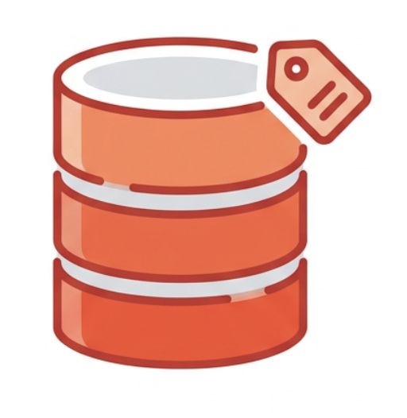
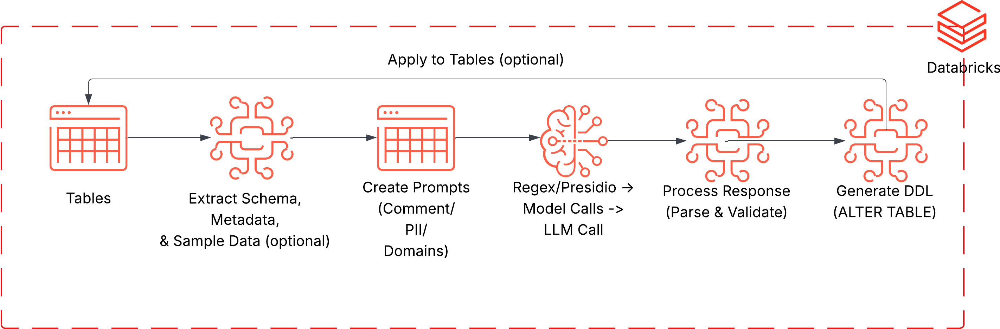
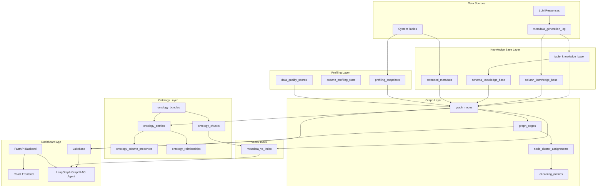

# dbxmetagen: AI-Native Metadata and Semantic Layer for Databricks



**dbxmetagen** turns raw Unity Catalog tables into governed, AI-queryable knowledge. It generates AI-reviewed metadata (descriptions, PII/PHI/PCI tags, business-domain classification), maps formalized ontologies to your schema, predicts join keys, builds a knowledge graph and retrieval layer on top, and uses that model to auto-generate a semantic layer (UC metric views) and Genie spaces, with human review at every step. The pipeline runs in four stages:

**1. Metadata generation**: the foundation

- **Comment generation**: AI-generated descriptions for tables and columns
- **PI classification**: Identify and tag PII, PHI, and PCI (LLM + rule-based spaCy/Presidio)
- **Domain classification**: Categorize tables into business domains and subdomains
- **Customer context**: Inject domain-specific knowledge into prompts, scoped by catalog/schema/table/pattern
- **Metadata review**: Human-in-the-loop review, edit, and apply workflow; the governance centerpiece

**2. Knowledge platform**: ontology, profiling, join keys, vector indexes, and knowledge graph

- **Knowledge base**: Aggregated table/column/schema metadata with extended system properties
- **Formal ontologies + entity discovery**: Map tables/columns to standard ontologies: FHIR R4, OMOP CDM, Schema.org, Dublin Core, FIBO Foundations (financial services), with multiple bundles coexisting in one schema
- **Knowledge graph**: Entity-relationship model with embeddings, similarity, clustering, and quality scores
- **FK prediction**: AI + heuristic foreign-key discovery (distinct from join-key suggestion), with column-similarity ranking and ontology hints
- **Data profiling & quality scoring**: Automated profiling with gradient-boosted quality grades
- **Vector Search indexes**: Hybrid semantic + lexical retrieval over metadata and ontology entities

**3. Semantic layer & Genie**: a business model from your data

- **Metric view generation**: Generate UC metric views (measures, dimensions, joins, filtered measures, windows) with SQL validation, deduplication, and autofix
- **Genie space builder**: Generate Genie spaces with instructions and example SQL, and **pull curated SQL from existing Genie spaces to seed new metric views** (cover a data-mart layer without touching the room)
- **ERD recommender**: Hybrid LLM + heuristic engine that proposes metric-view structure from your table relationships

**4. Agents & serving**: explore it in natural language

- **Deep analysis & analyst agents**: GraphRAG-style natural-language exploration of the catalog and its relationships
- **Metric-view agent**: chat-driven metric discovery over deployed views
- **Web dashboard**: FastAPI + React app covering the full lifecycle (Generate · Review · Explore)

The core value is **metadata generation and a governed knowledge graph**. The dashboard drives the
full lifecycle, but every output is a standard Delta table or Vector Search index you can consume
from any tool: notebooks, dashboards, Genie spaces, agents, or your own applications.

*Just want to get it running? Jump to the [**Quickstart**](#quickstart): deploy is Step 0 through Step 3, and [your first run](#your-first-run) is right after.*

> [!NOTE]
> **dbxmetagen is a Solutions Accelerator.** Every output — comments, PII/PHI/PCI tags, domain
> classifications, ontology mappings, FK predictions, metric views, Genie spaces — is AI-generated
> and meant to be reviewed by a human before it's applied or trusted. Nothing touches your catalog
> until you review and apply it (`apply_ddl=false` by default). See [Human Review](#human-review).

## Quickstart

> [!TIP]
> **Just want to deploy?** Set three variables ([Step 1](#step-1--set-your-per-workspace-variables-paths-a--b)), then run two commands ([Step 3, Path A](#path-a--cli-recommended)). Everything after that is optional or for other environments.

### Prerequisites

You always need a **Databricks workspace with Unity Catalog enabled** and a **Foundation Model endpoint** (e.g. `databricks-claude-sonnet-4-6`). Beyond that, requirements depend on how you deploy:


| Deploy path                                                                                                      | Also needs                                                                                                                  |
| ---------------------------------------------------------------------------------------------------------------- | --------------------------------------------------------------------------------------------------------------------------- |
| **CLI** ([Path A](#path-a--cli-recommended)) or **`deploy.sh`** ([Path B](#path-b--deploysh-legacy-one-command)) | Databricks CLI **≥ 1.10.0**, Python 3.10+, and [uv](https://docs.astral.sh/uv/) — uv builds the wheel locally during deploy |
| **Workspace UI** ([Path C](#path-c--workspace-ui-no-local-machine))                                              | Nothing extra — the wheel is built for you in the workspace                                                                 |
| **Notebook fallback**                                                                                            | Nothing extra — deploys from Databricks notebooks via the Python SDK                                                        |


**Node.js / `npm` is never required to deploy** — the React frontend ships prebuilt and committed. Only contributors who change the frontend rebuild it.

**How the steps map to paths:** Paths **A** and **B** (CLI) follow Steps 0–3 in order. Path **C** (workspace UI) sets its variables and deploys entirely in the bundle editor — skip Steps 0–1 and go straight to [Path C](#path-c--workspace-ui-no-local-machine). Step 2 (cloud node type) applies to every path.

### Step 0 — Install & authenticate the CLI (Paths A / B only)

**Skip this if you're deploying from the workspace UI** ([Path C](#path-c--workspace-ui-no-local-machine)) — the workspace is already authenticated. For the CLI paths, install the two tools from Prerequisites and log in once:

```bash
# 1. Databricks CLI (Homebrew shown; see the install docs for other OSes) — must be >= 1.10.0
brew tap databricks/tap && brew install databricks     # https://docs.databricks.com/dev-tools/cli/install.html
databricks version                                     # confirm >= 1.10.0

# 2. Log in — this creates the profile you pass as -p <your-profile>
databricks auth login --host https://<your-workspace-host> --profile <your-profile>
databricks auth profiles                               # verify <your-profile> is listed and VALID

# 3. Install uv (builds the wheel during deploy)
curl -LsSf https://astral.sh/uv/install.sh | sh        # or `brew install uv` -- https://docs.astral.sh/uv/
```

`<your-workspace-host>` is your workspace URL without a trailing slash (e.g. `dbc-1234abcd-5678.cloud.databricks.com`, `adb-123456789.11.azuredatabricks.net`, or `1234567890.gcp.databricks.com`). If you omit `--profile`, the credentials are written to the `DEFAULT` profile and you can drop `-p` from every command below.

### Step 1 — Set your per-workspace variables (Paths A / B)

`databricks.yml` is static and committed; you supply the per-workspace values as **bundle variable overrides**. The three required ones are `catalog_name`, `schema_name`, and `warehouse_id` (`vs_endpoint_name` is optional). DAB auto-loads them from `.databricks/bundle/<target>/variable-overrides.json` — **that exact path** (a repo-root copy is *not* picked up). `.databricks/` is gitignored and doesn't exist in a fresh clone, so create it:

```bash
git clone https://github.com/databricks-industry-solutions/dbxmetagen
cd dbxmetagen
mkdir -p .databricks/bundle/dev          # match your deploy target (-t)
cp variable-overrides.example.json .databricks/bundle/dev/variable-overrides.json
# then edit that file: set catalog_name, schema_name, warehouse_id
```

The workspace host comes from your CLI profile, not this file.

- **Where to find these values:** `catalog_name` / `schema_name` — the Unity Catalog catalog you want to document and the (new or existing) schema for the output tables; the schema is created if it doesn't exist. `warehouse_id` — **SQL Warehouses → your warehouse → Connection details** (or the last path segment of the warehouse's URL). Your **model endpoint** (the `databricks-claude-sonnet-4-6` default, or an override) must exist under **Serving** as a Foundation Model or provisioned-throughput endpoint — availability is region-dependent, so confirm it before deploying.
- **Deploying from the workspace UI ([Path C](#path-c--workspace-ui-no-local-machine))?** You don't create this file by hand — the **⋮ → Configure variable overrides** editor writes the same file for you inside your Git Folder. Follow Path C instead.
- **Prefer flags?** Pass `--var "catalog_name=...,schema_name=...,warehouse_id=..."` or `BUNDLE_VAR_*` env vars instead of the file.
- **Reference files:** `variable-overrides.example.json` (basic, copied above) and `variable-overrides.advanced.example.json` (adds `run_as` SP, OBO scopes, app permissions, cluster policy, Lakebase) are copy-ready. `variables.yml` / `variables.advanced.yml` / `resources/app_variables.yml` **declare** every overridable variable; `example.env` is an annotated human reference (no tool reads it, so you never edit it in place).

> If you skip this step the deploy still **succeeds** — the app just shows a clear **"CATALOG_NAME not set"** banner telling you what to fix. It never fails cryptically.

### Step 2 — Azure / GCP only: set the cluster node type

The default job-cluster `node_type` is `i3.2xlarge` (an **AWS** type). On another cloud, set `node_type` alongside your other variables before deploying — in `variable-overrides.json` for Paths A/B, or in the ⋮ **Configure variable overrides** editor for Path C:

- **Azure:** `Standard_D8s_v3`
- **GCP:** `n2-highmem-8`

### Step 3 — Deploy (pick one path)

All three paths are **equivalent, fully-supported peers**: the same bundle, the same `artifacts.build` wheel hook, the same **24 jobs + app**. Pick the one that matches your environment. Anything that applies *after* the deploy — starting the app, grants, OBO — is in [After deploy](#after-deploy) and is the same for all paths.

#### Path A — CLI (recommended)

```bash
databricks bundle deploy -t dev -p <your-profile>                # build wheel + register all 24 jobs & the app
databricks bundle run    -t dev -p <your-profile> dbxmetagen_app # deploy app source + start the app
```

That's the whole happy path. `bundle deploy` registers the app and syncs its files but does **not** start it — the `bundle run` line does. Best for CI, since each step is visible.

> **Cold first deploy:** if the app shows "not deployed yet," run `bundle deploy` again (or re-run the `bundle run` line). This can happen on a brand-new app or right after `bundle destroy`.

#### Path B — `deploy.sh` (legacy, one command)

A **legacy but fully-supported** wrapper that chains Path A's two commands into one:

```bash
./deploy.sh -t dev -p <your-profile>
```

It generates no YAML (`databricks.yml`, `app.yaml`, and the app resource are static committed files). It adds two conveniences for older setups:

- **`{target}.env` support** — if a `dev.env` / `demo.env` / `prod.env` exists, its scalar values (`catalog_name`, `schema_name`, `warehouse_id`, `vs_endpoint_name`, `node_type`, `budget_policy_id`, `enable_obo`, `app_name`, `app_name_suffix`, `app_display_name`, `model`) are forwarded as `--var` overrides, so a legacy `.env`-based deploy keeps working with no migration. (Knobs whose *shape* changed — `policy_id`, `spn_id`, `permission_groups/users` — are **not** forwarded; the script prints how to move them to `variable-overrides.json`.) A `variable-overrides.json` works here too.
- **pip → uv proxy bridge** — if `pip` has a private index (`global.index-url`) and `UV_INDEX_URL` is unset, it forwards that index to `uv` for the wheel build (corporate-proxy environments).

Flags: `-t/--target`, `-p/--profile`, `--yes-frontend` (rebuild the React frontend — **off by default**, since the committed `dist/` ships as-is; pass only when the app source changed), `--no-frontend` (a **no-op** kept for backward compatibility — the build is already skipped by default, so it never errors), `--no-vs` (skip the Vector Search endpoint + grant).

#### Path C — Workspace UI (no local machine)

The bundle editor's **Deploy** button is a first-class peer to the CLI — same engine, same wheel hook (the wheel is built for you in the workspace). See also [`docs/MANUAL_DEPLOYMENT.md`](docs/MANUAL_DEPLOYMENT.md).

1. Clone the repo as a **Git Folder** (**Workspace → your folder → Create → Git folder**, URL `https://github.com/databricks-industry-solutions/dbxmetagen`) and check out the branch you want.
2. Open **`databricks.yml`** in the editor. In the **Bundle** panel on the right, select your **target** (e.g. `dev`).
3. Click the **⋮** (three-dots) menu next to **Deploy** → **Configure variable overrides**, fill in `catalog_name`, `schema_name`, and `warehouse_id` (as JSON), then **Save**. This writes the same `.databricks/bundle/<target>/variable-overrides.json` the CLI reads, inside your Git Folder (gitignored, not committed). **For a one-step deploy, also add** `"app_lifecycle": {"started": true}` here — the UI always uses the direct engine, so this makes step 4 deploy the app source and start it in one click (see [After deploy](#after-deploy)).
4. Click **Deploy** (top of the bundle editor). This builds the wheel and registers all jobs + the app. If you set `app_lifecycle` in step 3, it also **deploys the app source and starts it in the same step** (wait a few minutes while it installs the wheel). Otherwise it only registers/syncs the app — start it in step 5.
5. **Start the app** (only if you did *not* set `app_lifecycle`, or the app shows **"App has not been deployed yet"** — which can also happen on a cold first deploy even with `started:true`): click the **run icon (▶)** on the `dbxmetagen_app` resource in the **Bundle resources** pane (the UI equivalent of `bundle run dbxmetagen_app`), **or** click **Deploy** again.

> **Do NOT use the app's own "Deploy" button on the Apps page.** That path reads `app.yaml` (which intentionally carries no env) and brings the app up **without** its configuration — this is the usual cause of the "CATALOG_NAME not set" banner. Only the **bundle-editor Deploy** (step 4) or the CLI `bundle run` applies the app's environment.

#### Fallback — Notebook deployment pipeline

If you can run **neither** the CLI nor the UI, deploy the app + **core jobs (8 of 24)** from Databricks notebooks via the Python SDK. Some dashboard features are unavailable. See [`notebook_deployment_pipeline/README.md`](notebook_deployment_pipeline/README.md). (This is different from the library-only [Partial Install](#partial-install-notebook-only) below.)

### Your first run

Open the app at **Workspace > Apps > dbxmetagen-app**. **Success looks like** the app loading its home page (not the "CATALOG_NAME not set" banner) with your catalog visible. Then generate and review metadata for one schema:

1. **Generate Metadata** → pick a schema in your catalog, leave the mode on **comment**, and click run. A small schema (~10 small tables) finishes in a few minutes. This sends table/column names and sample rows to your model endpoint.
2. Watch the job to completion (the app links to the run).
3. **Review & Apply** → read the generated descriptions, edit anything off, and **apply** the ones you approve. Nothing reaches Unity Catalog until you apply it (`apply_ddl=false` by default).
4. **Coverage** → confirm the schema now shows metadata coverage.

That's the core loop. From here, run **PI** and **domain** modes and the analytics pipeline (knowledge graph, ontology, metric views, Genie) — see the [Jobs](#jobs) and [Human Review](#human-review) sections, and [`docs/metadata_governance_workflow.md`](docs/metadata_governance_workflow.md) for the full review-and-publish model.

### After deploy

The items below apply to **all paths** and are each **optional**:

- **One-step deploy (`app_lifecycle`).** By default (`{}`) `bundle deploy` registers the app but doesn't start it — safe on **both** deploy engines. To make a single `bundle deploy` also push the app source and start it, set `app_lifecycle` to `{"started": true}` in your overrides. **This works only on the direct engine** (workspace UI and fresh CLI). A bundle whose state came from an older `deploy.sh`/CLI run stays on the **terraform** engine (the CLI does not auto-migrate), which rejects `started` at build time — leave it `{}` there. That's why `{}` is the default: it keeps every existing deploy working unchanged.
- **Grants (only if needed).** `scripts/grant_app_permissions.sh -t dev -p <your-profile>` grants the app service principal UC access and provisions a Vector Search endpoint — things DAB can't do natively. **Skip it** if you're not using OBO and the app SP already has catalog access. In the UI, run it from a workspace **web terminal**, or grant manually — see [`docs/MANUAL_DEPLOYMENT.md`](docs/MANUAL_DEPLOYMENT.md).
- **Jobs only:** run just `bundle deploy` (CLI) or the bundle **Deploy** (UI) and skip the app start + grants.
- **Multiple instances in one workspace.** The app is a **singleton by name**. To run more than one target/instance in the same workspace, set `app_name_suffix` (e.g. `-dev`) in your overrides — it's appended to both the app name and the job-name prefix, so instances don't overwrite each other.
- **On-Behalf-Of (OBO) user auth** — off by default; skip if `enable_obo=false`:
  - After enabling or re-scoping OBO, **re-consent in the browser** — a stale cached consent shows up as auth/scope errors. Open the app in an **incognito window** (or sign out/in) to force a fresh consent.
  - Scopes are declared for you (`files.files`, `serving.serving-endpoints`, `sql.statement-execution`, `dashboards.genie`), so no scope wrangling is needed. Declaring scopes requires the workspace's user-token-passthrough feature; if a target lacks it, override `user_api_scopes` to `[]` to opt out.
- **Advanced overrides** (cluster policy, serverless budget, `run_as` SP, app permissions, OBO scopes, Lakebase): copy `variable-overrides.advanced.example.json` into `.databricks/bundle/<target>/variable-overrides.json` (CLI) or paste the same keys into the UI's ⋮ **Configure variable overrides** editor.

## Partial Install (Notebook Only)

If you only need core metadata generation (comments, PI, domain) without the web dashboard, managed jobs, semantic layer, or Genie Builder, install the library directly on any Databricks cluster. No CLI, Asset Bundles, or repo clone needed.

> **Not the same as the [notebook *deployment* pipeline](notebook_deployment_pipeline/README.md).** That pipeline *deploys* the app plus core jobs from notebooks (for environments that can run neither the CLI nor the UI). This section instead just **installs the library** so you can call `main()` directly — no app, no jobs, no bundle.

### 1. Install

In a Databricks notebook cell:

```python
%pip install -qqq git+https://github.com/databricks-industry-solutions/dbxmetagen.git@main
dbutils.library.restartPython()
```

Or if you cloned the repo, install from local source:

```python
%pip install -qqq -r ../requirements.txt ..
dbutils.library.restartPython()
```

### 2. Generate metadata

```python
from dbxmetagen.main import main

main({
    "catalog_name": "my_catalog",
    "table_names": "my_catalog.my_schema.my_table",
    "mode": "comment",              # or "pi" or "domain"
    "schema_name": "metadata_results",
    "model": "databricks-claude-sonnet-4-6",
    "table_names_source": "parameter",
})
```

Use `"my_catalog.my_schema.*"` to process all tables in a schema.

#### Customer context (optional)

Inject your own business meaning into every prompt — glossary terms, column
semantics, "what this schema really is" — so generated comments and classifications
reflect domain knowledge, not just the data shape. Write a YAML file with a
top-level `contexts:` list (see `examples/customer_context.yaml`):

```yaml
# ./contexts/my_context.yaml
contexts:
  - scope: my_catalog.my_schema        # catalog | schema | table | pattern (glob)
    scope_type: schema
    context_text: >-
      Investment-ops warehouse. "Position" = a portfolio holding, not a job role.
      Amounts are USD unless a currency column says otherwise.
```

Then point `main()` at the folder — it seeds the `customer_context` table (a MERGE,
so re-runs are idempotent) before generating. **Both keys are required:**

```python
main({
    "catalog_name": "my_catalog",
    "table_names": "my_catalog.my_schema.*",
    "mode": "comment",
    "schema_name": "metadata_results",
    "table_names_source": "parameter",
    "use_customer_context": "true",
    "customer_context_yaml_dir": "./contexts",   # folder of *.yaml files
})
```

More specific scopes win (table > pattern > schema > catalog); matches are
concatenated in that order. This is the same `customer_context` table the app UI
manages, so context seeded here also shows up there.

### 3. Run analytics (optional)

After metadata generation, build the knowledge base and graph:

```python
from pyspark.sql import SparkSession
from dbxmetagen import build_knowledge_base, build_knowledge_graph, generate_embeddings, build_ontology

spark = SparkSession.builder.getOrCreate()
build_knowledge_base(spark, "my_catalog", "metadata_results")
build_knowledge_graph(spark, "my_catalog", "metadata_results")
generate_embeddings(spark, "my_catalog", "metadata_results")
build_ontology(spark, "my_catalog", "metadata_results")
```

The `examples/` notebooks show how to use dbxmetagen as a **standalone pip-installable library** -- useful for embedding into your own projects or quick ad-hoc runs. They install directly from GitHub and do not require cloning the repo or running `deploy.sh`. See the [examples README](examples/README.md) for details.


| Notebook                                 | What it does                                                        |
| ---------------------------------------- | ------------------------------------------------------------------- |
| `examples/01_generate_metadata.py`       | Run all three modes (comment, PI, domain) for richest Genie context |
| `examples/02_build_knowledge_bases.py`   | Structured KB tables from raw metadata                              |
| `examples/03_build_analytics.py`         | Graph, ontology, embeddings, profiling, FK prediction, quality      |
| `examples/04_generate_semantic_layer.py` | Metric view definitions from business questions                     |
| `examples/05_create_genie_spaces.py`     | Genie spaces with auto-splitting for large schemas                  |


## Disclaimer

> **Regulatory compliance — including HIPAA — is always the sole responsibility of the user.**
> dbxmetagen is a tool that generates and classifies metadata; it does **not** guarantee, certify,
> or ensure HIPAA (or any other regulatory) compliance. PII/PHI/PCI detection is AI-assisted and
> **not** a substitute for a compliance review. You are responsible for validating all output,
> controlling what data is sent to model endpoints, and meeting every legal and regulatory
> obligation that applies to your data and jurisdiction.

- AI-generated metadata must be human-reviewed for compliance — PII/PHI/PCI detection can produce
false negatives, and you must review all sensitivity classifications before relying on them.
- Generated comments may include data samples depending on settings (`sample_size`, `allow_data`);
set `sample_size=0` to send no row data to the model.
- Unless configured otherwise, dbxmetagen sends data to the specified model endpoint. You control
the endpoint and what data leaves your environment.
- Compliance (e.g., HIPAA, GDPR, PCI-DSS) is the user's responsibility, as stated above.

## Architecture


```mermaid
flowchart TB
    subgraph sources [Data Sources]
        SYS[System Tables]
        LOG[metadata_generation_log]
        LLM[LLM Responses]
    end

    subgraph kb [Knowledge Base Layer]
        TKB[table_knowledge_base]
        CKB[column_knowledge_base]
        SKB[schema_knowledge_base]
        EXT[extended_metadata]
    end

    subgraph profiling [Profiling Layer]
        PROF[profiling_snapshots]
        CS[column_profiling_stats]
        DQ[data_quality_scores]
    end

    subgraph graph [Graph Layer]
        GN[graph_nodes]
        GE[graph_edges]
        NCA[node_cluster_assignments]
        CM[clustering_metrics]
    end

    subgraph ontology [Ontology Layer]
        ONT_CFG[ontology_bundles]
        ENT[ontology_entities]
        OCP[ontology_column_properties]
        ORL[ontology_relationships]
        OCH[ontology_chunks]
    end

    subgraph vector [Vector Index]
        VSI[metadata_vs_index]
    end

    subgraph app [Dashboard App]
        API[FastAPI Backend]
        UI[React Frontend]
        AGT[LangGraph GraphRAG Agent]
        LB[Lakebase]
    end

    SYS --> EXT
    SYS --> PROF
    LOG --> TKB
    LOG --> CKB
    TKB --> SKB
    LLM --> LOG

    TKB --> GN
    CKB --> GN
    SKB --> GN
    EXT --> GN
    PROF --> GN
    DQ --> GN

    GN --> GE
    GE --> NCA
    NCA --> CM

    ONT_CFG --> ENT
    ONT_CFG --> OCH
    GN --> ENT
    ENT --> OCP
    ENT --> ORL

    GN --> VSI
    OCH --> VSI

    GN --> LB
    GE --> LB
    LB --> AGT
    VSI --> AGT
    API --> AGT
    API --> UI
```

### Pipeline overview

dbxmetagen has two phases:

**Phase 1 -- Core metadata generation** (`generate_metadata.py` / `main()`):

- Runs one mode at a time: `comment`, `pi`, or `domain`
- Run comment mode first (or in parallel with PI + domain via `metadata_parallel_modes_job`) -- the analytics pipeline depends on all three modes having completed
- Writes results to `metadata_generation_log`
- Can apply DDL directly or output to files for review
- Each run re-processes all tables in scope (no incremental mode for generation)

**Phase 2 -- Analytics pipeline** (run after Phase 1):

- Aggregates log data into knowledge bases (table, column, schema)
- Builds a knowledge graph with nodes and edges
- Generates embeddings, discovers ontology entities, computes similarity
- Runs profiling, quality scoring, clustering, and FK prediction
- Supports incremental mode (`incremental=true`): each task checks upstream watermarks and skips if nothing changed

### Layers


| Layer              | Tables                                                                                                             | Purpose                                                                                                                                |
| ------------------ | ------------------------------------------------------------------------------------------------------------------ | -------------------------------------------------------------------------------------------------------------------------------------- |
| **Knowledge Base** | `table_knowledge_base`, `column_knowledge_base`, `schema_knowledge_base`, `extended_metadata`                      | Aggregated metadata from LLM outputs and system tables                                                                                 |
| **Profiling**      | `profiling_snapshots`, `column_profiling_stats`, `data_quality_scores`                                             | Statistical profiling and quality scoring                                                                                              |
| **Graph**          | `graph_nodes`, `graph_edges`, `node_cluster_assignments`, `clustering_metrics`, `community_summaries`              | Graph analytics with embeddings, similarity edges, K-means clustering, and AI-generated community summaries                            |
| **Ontology**       | `ontology_entities`, `ontology_column_properties`, `ontology_relationships`, `ontology_chunks`, `ontology_metrics` | Business entity discovery, column classification, relationship detection, and vector retrieval                                         |
| **Vector Index**   | `metadata_vs_index`, `ontology_vs_index`                                                                           | Hybrid semantic search over metadata documents and ontology entities. See [docs/CONFIGURATION.md](docs/CONFIGURATION.md#vector-search) |


All output tables are standard Delta tables in your output schema (`{catalog}.{schema_name}`), queryable via SQL, notebooks, or any tool that reads from Unity Catalog.

The ontology and graph system is inspired by semantic web standards (RDF, OWL, SHACL) but stores everything in Delta tables queryable via SQL. Industry bundles align with domain standards (FHIR, OMOP, Schema.org). See [docs/formal_semantics.md](docs/formal_semantics.md) for a detailed comparison.

## Human Review

Every pipeline step produces AI-generated output meant to be reviewed before it's applied to Unity Catalog. By default, `apply_ddl=false` -- nothing touches your catalog until you review and apply.

Review guidance by step:

- **Comments**: spot-check 10-20% of descriptions, especially tables with domain-specific terminology
- **PI / PHI / PCI**: review ALL sensitivity classifications -- false negatives have compliance implications
- **Domain**: verify domain assignments match your business context
- **Ontology**: check entity mappings, especially those with confidence below 0.6
- **FK predictions**: approve correct predictions, reject false positives; use "Sync Knowledge Graph" after to propagate decisions
- **Metric views**: verify SQL expressions are valid and semantically correct before applying

The app's **Review & Apply** page is the primary review interface. The **Coverage** page tracks completeness across your schema.

### How FK review works

The review UI lists **every** candidate join for the tables in scope, ranked by confidence -- not only the pairs the model predicted as foreign keys (`is_fk=true`). Confidence is shown as a signal to help you decide, not as a filter. Your review decision is authoritative in **both** directions:

- **Reject** a predicted FK you don't want, and it stops flowing downstream.
- **Approve** a join the model did *not* predict as an FK (a lower-confidence or `is_fk=false` pair). Approving sets `is_fk=true` and marks the row reviewed.

Only reviewed-and-approved (or model-predicted `is_fk=true`) joins are synced into the knowledge graph, Vector Search index, metric views, and DDL -- these consumers all filter on `is_fk`. A prediction that lingers in the review list but is never approved has no downstream effect. Approved rows are locked: re-running FK prediction (including a `sweep_stale` refresh) never overwrites a reviewed decision. Use **Sync Knowledge Graph** after reviewing to propagate your decisions.

## Interpreting Ontology Results

The ontology pipeline maps your tables and columns to business concepts defined in industry-standard bundles (FHIR, OMOP, Schema.org) or custom ontologies. Key output tables:

- **`ontology_entities`**: each row maps a table to a business concept (e.g., `dim_patient` -> `Patient`). The `confidence` column (0-1) reflects match certainty and `discovery_method` indicates whether it was keyword-based or LLM-classified. Review entities with confidence below 0.6.
- **`ontology_column_properties`**: assigns a `property_role` to each column in entity-mapped tables -- `primary_key`, `business_key`, `measure`, `dimension`, `temporal`, `geographic`, `label`, `audit`, or `object_property` (foreign reference).
- **`ontology_relationships`**: entity-to-entity relationships (e.g., `Encounter` references `Patient`) derived from FK predictions and column analysis.

See [docs/DOMAIN_ONTOLOGY_ARCHITECTURE.md](docs/DOMAIN_ONTOLOGY_ARCHITECTURE.md) for the full architecture and bundle comparison.

## Data Privacy

dbxmetagen sends the following to the configured LLM endpoint during metadata generation:

- Table and column names, data types, and schema structure (always)
- Sample row data (when `allow_data=true`, the default)

Set `sample_size=0` to send no sample rows to the model; schema and column metadata are still sent. PII/PHI data values are never logged by the pipeline -- only metadata about detections (classification, type, confidence).

## Ontology Bundles and Deployment

Use **one ontology bundle per output schema**. This keeps entities, edges, column properties, and the vector index internally consistent.

If your data spans multiple domains (e.g., clinical + financial), deploy to **separate output schemas** per bundle:

- `catalog.metadata_clinical` with `ontology_bundle=fhir_r4`
- `catalog.metadata_financial` with `ontology_bundle=schema_org`

Switching `ontology_bundle` on the same schema between runs works but creates orphaned downstream data (stale docs, edges, embeddings). Clean up by enabling `sweep_stale_docs=true` and `sweep_stale_edges=true` on the next pipeline run, or see "Cleaning Up Previous Runs" below.

## Cleaning Up Previous Runs

Check edge counts by source system to diagnose graph issues:

```sql
SELECT source_system, COUNT(*) FROM {catalog}.{schema}.graph_edges GROUP BY 1;
```

Common cleanup scenarios:

- **Too many similarity edges**: delete and let the pipeline regenerate with ANN (the default):
  ```sql
  DELETE FROM {catalog}.{schema}.graph_edges WHERE source_system = 'embedding_similarity';
  ```

  Or re-run the analytics pipeline with `sweep_stale_edges=true`.
- **Orphaned ontology data after bundle switch**: enable "Sweep stale docs" in the Advanced Metadata tab (passes `sweep_stale_docs=true`) and run with `sweep_stale_edges=true`.
- **Full reset**: drop the output schema and re-deploy. The pipeline will recreate all tables.

## Scaling

Processing time depends on table count, column width, cluster size, and parallelism. Order-of-magnitude estimates for comment mode:


| Tables        | Estimate            | Recommended parallelism |
| ------------- | ------------------- | ----------------------- |
| 10-100        | Minutes             | 1 task (default)        |
| 1,000-5,000   | Hours               | 5-10 parallel tasks     |
| 10,000-50,000 | Many hours to a day | 50+ parallel tasks      |


Key tuning knobs: `columns_per_call` (default 10 -- higher reduces LLM calls for wide tables), `sample_size` (rows per prompt), and multi-task parallelism via the control table. Similarity edges use ANN by default (`use_ann=True`) to avoid quadratic scaling. See [docs/CONFIGURATION.md](docs/CONFIGURATION.md) for all parameters.

## API Reference

Core functions exported by the `dbxmetagen` package:


| Function                                              | Description                                             |
| ----------------------------------------------------- | ------------------------------------------------------- |
| `main(kwargs)`                                        | Entry point for metadata generation (comment/PI/domain) |
| `build_knowledge_base(spark, catalog, schema)`        | Build table-level knowledge base from generation log    |
| `build_column_knowledge_base(spark, catalog, schema)` | Build column-level knowledge base                       |
| `build_schema_knowledge_base(spark, catalog, schema)` | Build schema-level knowledge base                       |
| `extract_extended_metadata(spark, catalog, schema)`   | Extract system metadata via DESCRIBE EXTENDED           |
| `build_knowledge_graph(spark, catalog, schema)`       | Build graph nodes and edges from KB tables              |
| `generate_embeddings(spark, catalog, schema)`         | Generate vector embeddings for graph nodes              |
| `build_similarity_edges(spark, catalog, schema)`      | Create similarity edges from embeddings                 |
| `build_ontology(spark, catalog, schema)`              | Discover and store business entities                    |
| `validate_ontology(spark, catalog, schema)`           | Validate discovered entities                            |
| `run_profiling(spark, catalog, schema)`               | Profile tables and columns                              |
| `compute_data_quality(spark, catalog, schema)`        | Compute data quality scores                             |
| `predict_foreign_keys(spark, catalog, schema)`        | Predict FK relationships using AI + heuristics          |
| `build_vector_index(spark, catalog, schema)`          | Build or refresh Vector Search index over metadata      |
| `build_genie_space(spark, catalog, schema)`           | Create Genie space from knowledge base                  |
| `generate_semantic_layer(spark, catalog, schema)`     | Generate metric view definitions                        |
| `classify_columns_geo(spark, catalog, schema)`        | Geographic column classification                        |


## Notebooks

All notebooks live in `notebooks/`. The primary entry point is `generate_metadata.py` (used by all DAB jobs for comment, PI, and domain generation). Analytics notebooks (KB, graph, profiling, ontology, FK prediction, etc.) are orchestrated by the DAB pipeline jobs listed below.

## Configuration

### Quickstart (pip install)

When installed via pip, default configurations for domain classification and ontology are bundled in the wheel. Override by passing `domain_config_path` or `ontology_config_path` as kwargs.

### Full deployment (DAB)

Settings are in `variables.yml`. Key options:


| Setting                    | Default                        | Description                                                                                                                                                                                        |
| -------------------------- | ------------------------------ | -------------------------------------------------------------------------------------------------------------------------------------------------------------------------------------------------- |
| `catalog_name`             | (required)                     | Unity Catalog name                                                                                                                                                                                 |
| `schema_name`              | `metadata_results`             | Output schema                                                                                                                                                                                      |
| `model`                    | `databricks-claude-sonnet-4-6` | LLM endpoint for generation                                                                                                                                                                        |
| `mode`                     | `comment`                      | Generation mode: `comment`, `pi`, or `domain`                                                                                                                                                      |
| `apply_ddl`                | `false`                        | Apply generated metadata directly to Unity Catalog                                                                                                                                                 |
| `allow_data`               | `true`                         | Set `false` to prevent data from being sent to LLMs                                                                                                                                                |
| `node_type`                | `i3.2xlarge`                   | Job cluster node type. Change for Azure (`Standard_D8s_v3`) or GCP (`n2-highmem-8`)                                                                                                                |
| `include_deterministic_pi` | `true`                         | Enable SpaCy/Presidio for rule-based PI detection (default model: `en_core_web_md`; set `spacy_model_names=en_core_web_lg` for higher accuracy -- see [Configuration docs](docs/CONFIGURATION.md)) |
| `federation_mode`          | `false`                        | Enable for federated catalog sources (Redshift, Snowflake)                                                                                                                                         |


For full reference, see [docs/CONFIGURATION.md](docs/CONFIGURATION.md).

**Customer Context**: inject domain-specific knowledge (glossaries, naming conventions, business rules) scoped by catalog/schema/table/pattern to improve generation quality. Manage context entries via the app's Generate Metadata page or YAML files in `configurations/customer_context/`.

## Dashboard App

The app is in `apps/dbxmetagen-app/` and provides a FastAPI backend with a React frontend. Deployed via DAB. Navigation is organized into three categories:

**Design:**

- **Generate Metadata** -- Trigger core (descriptions, sensitivity, domain) and advanced (ontology, FK, knowledge graph) jobs with model selection, Customer Context management
- **Define Metrics** -- Auto-generated metric views with SQL expression autofix, KPI Library grouped by Question Profile
- **Build Genie Space** -- Create and configure Genie spaces with auto-generated instructions and example SQL queries

**Review:**

- **Review & Apply** -- Browse, edit, approve, and apply generated metadata back to Unity Catalog
- **Coverage** -- Schema-wide metadata coverage summary and completeness metrics

**Explore:**

- **Agent** -- Deep analysis chat with GraphRAG, graph explorer, semantic search, and MLflow trace links
- **Entity Browser** -- Entity-first navigation with conformance view

**Permissions model:** The app uses two separate identities. The **app service principal** (SPN) controls what the app UI can *read* -- it needs SELECT on your catalog to browse tables, coverage, metadata, and graph data. The **deployer's identity** (the user who ran `databricks bundle deploy`) controls what jobs can *write* -- jobs run as the deployer and need CREATE TABLE, ALTER TABLE, and SET TAGS on the target catalog. This means a user can see metadata in the app even if they don't have permission to generate or apply it, and conversely, the app SPN doesn't need write access to your tables. UC grants for the app SPN are applied by `scripts/grant_app_permissions.sh` (run after each deploy). See [docs/PERMISSIONS.md](docs/PERMISSIONS.md) for the full permissions reference including OBO mode, Vector Search, and end-user access.

**Deep Analysis Agent:** Natural-language queries using a LangGraph GraphRAG pipeline that combines Vector Search retrieval, multi-hop graph traversal via Lakebase, FK/KB lookups, and LLM-generated data queries. Results include MLflow trace links for observability.

## Jobs


| Job Resource                       | Description                                                                                                                                                                                                                                                                                                    |
| ---------------------------------- | -------------------------------------------------------------------------------------------------------------------------------------------------------------------------------------------------------------------------------------------------------------------------------------------------------------- |
| `metadata_generator_job`           | Single-mode metadata generation (comment, PI, or domain)                                                                                                                                                                                                                                                       |
| `metadata_parallel_modes_job`      | All 3 modes in parallel (comment first, then PI + domain)                                                                                                                                                                                                                                                      |
| `metadata_with_knowledge_base_job` | Metadata generation followed by KB + knowledge graph build                                                                                                                                                                                                                                                     |
| `full_analytics_pipeline_job`      | Full pipeline: KB, graph, embeddings, profiling, ontology, similarity, clustering, FK prediction                                                                                                                                                                                                               |
| `knowledge_base_builder_job`       | Knowledge base and knowledge graph only                                                                                                                                                                                                                                                                        |
| `ontology_prediction_job`          | Ontology discovery and validation                                                                                                                                                                                                                                                                              |
| `profiling_job`                    | Table profiling, quality scoring, and graph quality update                                                                                                                                                                                                                                                     |
| `fk_prediction_job`                | Foreign key prediction with column similarity and AI judgment                                                                                                                                                                                                                                                  |
| `semantic_layer_job`               | Generate metric views and apply to Genie spaces                                                                                                                                                                                                                                                                |
| `sync_graph_lakebase_job`          | Sync graph data to Lakebase for the dashboard                                                                                                                                                                                                                                                                  |
| `build_vector_index_job`           | Rebuild the metadata vector search index (serverless). Deployed with a weekly schedule (Sun 02:00 UTC) but **paused by default** -- unpause in the Workflows UI to keep the index fresh automatically. Without it the index only updates on full pipeline runs or manual "Sync Vector Index" clicks in the app |
| `build_knowledge_graph_job`        | Rebuild knowledge graph nodes and edges (serverless). Use after reviewing foreign keys to propagate approve/reject decisions without re-running the full pipeline                                                                                                                                              |
| `sync_ddl_job`                     | Sync reviewed/edited DDL back to Unity Catalog                                                                                                                                                                                                                                                                 |


## MCP Servers (Coming Soon)

> **Note:** MCP server support is under active development and not yet ready for production use.

dbxmetagen exposes its knowledge base, knowledge graph, and vector index as [Databricks Managed MCP servers](https://docs.databricks.com/aws/en/generative-ai/mcp). Any MCP-compatible client (Cursor, Claude Code, AI Playground) can query your metadata catalog directly. See [docs/MCP_SERVERS.md](docs/MCP_SERVERS.md) for client configuration, the full tool reference, and a walkthrough of how the dashboard's deep analysis agent uses these same data assets.

## Documentation


| Guide                                                                  | Description                                                                                                                                           |
| ---------------------------------------------------------------------- | ----------------------------------------------------------------------------------------------------------------------------------------------------- |
| [Configuration](docs/CONFIGURATION.md)                                 | All runtime parameters, ontology bundles, Vector Search, Lakebase, OBO, and community summaries                                                       |
| [Permissions](docs/PERMISSIONS.md)                                     | Two-identity model (app SPN vs job owner), UC grants, OBO mode, and end-user access                                                                   |
| [Workspace UI Deployment](docs/MANUAL_DEPLOYMENT.md)                   | First-class Databricks Asset Bundles deploy from the workspace UI (peer to the CLI path; the wheel is built in-workspace)                             |
| [Migration Guide](docs/MIGRATION.md)                                   | Upgrading a workspace deployed with the old `deploy.sh` -- one-time cleanup of stale synced files, and what's safe (your generated data is untouched) |
| [Domain & Ontology Architecture](docs/DOMAIN_ONTOLOGY_ARCHITECTURE.md) | Formal vs custom ontology bundles, domain YAML, and how they interact                                                                                 |
| [MCP Servers](docs/MCP_SERVERS.md)                                     | Managed MCP server setup, tool reference, and agent integration                                                                                       |
| [QA Checklist](docs/QA_CHECKLIST.md)                                   | Pre-release validation checklist                                                                                                                      |
| [Dependencies](docs/DEPENDENCIES.md)                                   | Third-party dependency inventory                                                                                                                      |


## Testing

```bash
uv sync                     # core deps (comment/domain modes)
uv sync --extra pi          # spaCy/Presidio libs for PI dev (model installed separately)
uv pip install -r requirements-pi.txt   # the en_core_web_md spaCy model (required for PI mode)
./run_tests.sh              # runs 3 test suites in isolated processes
./run_tests.sh -q           # quick mode (core tests only)

# Bump dependencies (developers only; uv.lock is gitignored)
# 1. Edit pyproject.toml
# 2. uv lock                    # local only; internal proxy on corp laptops
# 3. bash scripts/export_requirements.sh
# 4. Commit pyproject.toml + requirements.txt (not uv.lock)

# Build and test wheel locally
uv build
pip install dist/*.whl
python -c "from dbxmetagen.config import MetadataConfig; print('OK')"
```

DDL regenerator and binary/variant tests must run in separate processes due to import conflicts -- `run_tests.sh` handles this automatically.

Requires DBR 14.3+ (ML runtime recommended for PI detection with spaCy). Serverless runtimes are supported for most operations.

## Troubleshooting

### PyPI / `uv` on Databricks corp laptops vs external customers

**Databricks internal laptops** cannot reach public PyPI. Set in your shell profile:

```bash
export UV_INDEX_URL=https://pypi-proxy.dev.databricks.com/simple
export UV_NATIVE_TLS=1
```

Use that for `uv sync`, `uv lock`, `databricks bundle deploy`, and `./publish.sh`. Local `uv.lock` is gitignored; never commit it (it may contain internal proxy URLs). When bumping deps, export `requirements.txt` with `bash scripts/export_requirements.sh` and commit that file.

**External customers on public PyPI** need no special config — `uv` defaults to public PyPI, and the deploy build hook (`scripts/build_artifacts.sh`) only runs `uv build` (hatchling) and does not use `uv.lock`.

**External customers behind a proxy / on a private PyPI mirror (air-gapped):** the build hook does **not** scrub your environment, so standard `uv`/pip settings flow straight through to `uv build`. Set them in your shell before `databricks bundle deploy` (or in the workspace-UI build environment):

```bash
export UV_INDEX_URL=https://your-private-mirror/simple   # or UV_EXTRA_INDEX_URL
export UV_NATIVE_TLS=1                                    # trust the corporate CA
export HTTPS_PROXY=http://proxy.your-corp:8080           # if you route through an HTTP proxy
```

The **app's runtime `pip install`** (of `apps/dbxmetagen-app/app/requirements.txt`) runs in the Databricks Apps *platform* environment, which this repo cannot configure per-deploy. To route that install at a private mirror, either configure your workspace's package access (a Databricks workspace setting) or add an `--index-url` / `--extra-index-url` line to `apps/dbxmetagen-app/app/requirements.txt.template` and rebuild.

### `bundle deploy` fails downloading from `pypi-proxy.dev.databricks.com`

This URL is only reachable on Databricks internal networks. If you are **not** on a corp laptop, unset any internal proxy:

```bash
unset UV_INDEX_URL
```

If you **are** on a corp laptop, ensure `UV_INDEX_URL` points at the internal proxy (see above), not `pypi.org`.

### `uv sync` fails with `invalid peer certificate: UnknownIssuer`

If you see an error like:

```
error: Request failed after 3 retries
  Caused by: invalid peer certificate: UnknownIssuer
```

This happens because `uv` uses `rustls` by default, which relies on a bundled certificate store rather than the system's native trust store. Corporate proxies and firewalls that inject their own CA certificates are not recognized.

**Fix:** tell `uv` to use the system's native TLS stack:

```bash
export UV_NATIVE_TLS=1
```

Add this to your shell profile (`~/.zshrc`, `~/.bashrc`, etc.) to make it permanent.

### Frontend build (`npm run build`) hangs or fails

Building the React frontend runs `npm install` and `npm run build`. Common issues:

- **npm not installed:** Install Node.js (which includes npm) from [https://nodejs.org/](https://nodejs.org/) or via `brew install node`.
- **npm registry unreachable:** Corporate firewalls or VPNs may block `registry.npmjs.org`. Check your network/proxy settings.
- **npm crashes ("Exit handler never called"):** This is a [known npm 11.x bug](https://github.com/npm/cli/issues). Fix by clearing the cache and retrying.
If that doesn't help, downgrade npm: `npm install -g npm@10`

**Workaround:** The pre-built frontend (`apps/dbxmetagen-app/app/src/dist/`) is committed to the repo, so if you haven't changed any frontend code you can skip the `npm run build` step entirely and deploy the committed `dist/` directly:

```bash
databricks bundle deploy -t dev -p <your-profile>
```

### Jobs fail with "Instance type not supported" or "NODE_TYPE_NOT_SUPPORTED"

The default `node_type` in `variables.yml` is `i3.2xlarge`, which is an AWS instance type. If you're running on Azure or GCP, job clusters will fail to start.

**Fix:** Update `node_type` in `variables.yml` to match your cloud:


| Cloud | Recommended `node_type` |
| ----- | ----------------------- |
| AWS   | `i3.2xlarge` (default)  |
| Azure | `Standard_D8s_v3`       |
| GCP   | `n2-highmem-8`          |


You may need to try a couple different node types if your organization doesn't have capacity for these in your cloud.

### App serves the wrong config after deploying more than one target to the same workspace

The app is a **singleton by name** in a workspace. Jobs are keyed by ID (dev mode prefixes their
names so targets coexist), but the app resource name is **not** dev-prefixed — so deploying two
targets (e.g. `dev` and `demo`) into one workspace makes both own the single app, and **last deploy
wins**. Symptoms are the app reporting `WAREHOUSE_ID not configured`, OBO disabled, or missing job
IDs, because the last-deployed target's overrides are now active.

**Fix:** set `app_name_suffix` (default `""`, fully backward compatible) in your overrides to run
separate instances in one workspace — it is appended to both the app name and the job-name prefix
(e.g. `-dev`). Alternatively, deploy each target to its own workspace.

### Workspace UI deploy builds a stale or missing wheel

When you deploy from the **workspace UI Deploy button**, the `artifacts.build` hook
(`scripts/build_artifacts.sh`) runs in the workspace-hosted build environment, which must have `uv`
and Python 3.11+. If either is missing, the UI deploy can fail or ship a stale wheel / missing
`configurations/`. The **CLI** path builds on your own machine and is unaffected. If you hit this,
prefer the CLI deploy, or see [docs/MANUAL_DEPLOYMENT.md](docs/MANUAL_DEPLOYMENT.md) for the
in-workspace build requirements.

### Known Limitations

- **`sample_size=0` degrades PI and domain quality.** With no row sampling, PI detection and domain
classification rely on column names, types, and existing comments rather than data values. Keep a
non-zero `sample_size` (or set `allow_data=false` only when you specifically must not send data to
the LLM) for best results.
- **Very large catalogs need tuning.** Defaults are tuned for tens-to-thousands of tables. For
10,000+ tables, raise multi-task parallelism and `columns_per_call` (see [Scaling](#scaling)).
Further throughput/cost work — batching column/table classification LLM calls and batching
`DESCRIBE EXTENDED` via `information_schema` — is planned and is not required for typical runs.
- **Federated sources.** In `federation_mode`, `DESCRIBE EXTENDED`, `ALTER TABLE`, and `SET TAGS` are
disabled and all output is Delta-native; start with a small table set to gauge source-query load
before scaling up.

## Dependencies

The core library and all frontend packages use permissive licenses (Apache 2.0, MIT, BSD, PSF).
The one exception is the app's Postgres/Lakebase driver `psycopg2-binary` (**LGPL v3 with
exceptions**, used unmodified as a dynamically-linked app dependency). See
[docs/DEPENDENCIES.md](docs/DEPENDENCIES.md) for the full package/version/license table.

## License

This project is licensed under the Databricks DB License.

## Acknowledgements

Thanks to James McCall, Diego Malaver, Aaron Zavora, and Charles Linville for discussions around dbxmetagen.