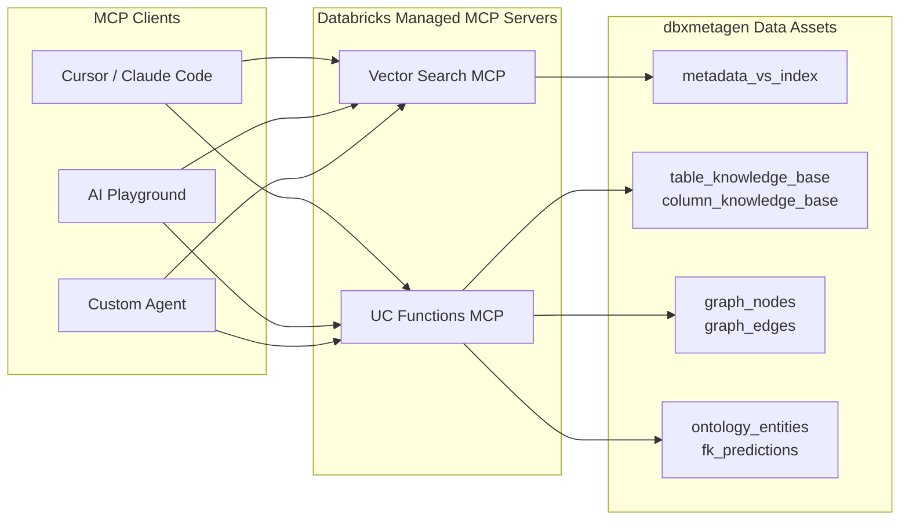
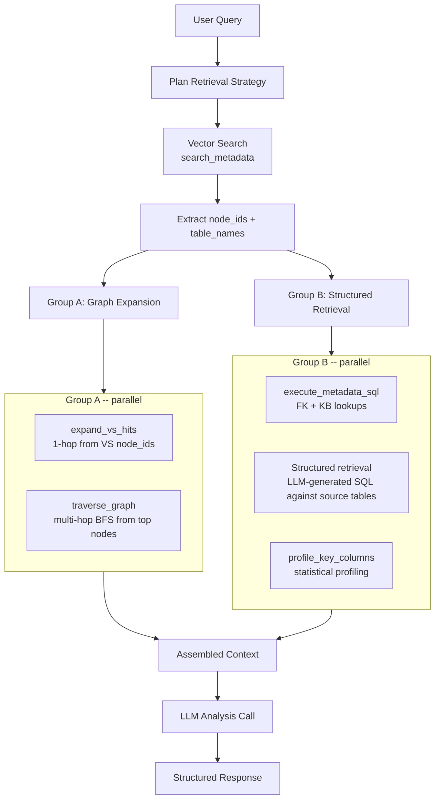

# MCP Servers for dbxmetagen

dbxmetagen exposes its metadata assets -- knowledge base, knowledge graph, and vector index -- as [Databricks Managed MCP servers](https://docs.databricks.com/aws/en/generative-ai/mcp). This lets any MCP-compatible client (Cursor, Claude Code, AI Playground, custom agents) query your metadata catalog using natural tool invocations.

## Architecture



Two managed MCP servers are exposed:

| Server | URL Pattern | Purpose |
|--------|------------|---------|
| **Vector Search** | `{host}/api/2.0/mcp/vector-search/{catalog}/{schema}/metadata_vs_index` | Hybrid semantic search over all indexed metadata |
| **UC Functions** | `{host}/api/2.0/mcp/functions/{catalog}/{schema}` | Structured queries against KB tables and knowledge graph |

Both servers are governed by Unity Catalog permissions and support on-behalf-of-user authentication.

## Setup

Run the setup notebook to create the UC Functions:

```bash
databricks bundle run setup_mcp_servers_job -t dev -p <profile>
```

Or open `tests/data/setup_mcp_servers.py` in the Databricks UI and Run All. The notebook:

1. Validates that KB, graph, and VS tables exist in your schema
2. Creates 9 UC SQL functions (the MCP tools)
3. Prints ready-to-paste configuration for Cursor/Claude Code

### Prerequisites

The UC Functions query tables created by the dbxmetagen analytics pipeline. Run the pipeline first:

```bash
databricks bundle run full_analytics_pipeline_job -t dev -p <profile>
```

The Vector Search MCP server requires the `metadata_vs_index` to be built:

```bash
databricks bundle run build_vector_index_job -t dev -p <profile>
```

## Client Configuration

### Cursor / Claude Code

Add to `.cursor/mcp.json`:

```json
{
  "mcpServers": {
    "dbxmetagen-knowledge": {
      "type": "streamable-http",
      "url": "https://<workspace-host>/api/2.0/mcp/functions/<catalog>/<schema>",
      "headers": { "Authorization": "Bearer <PAT>" }
    },
    "dbxmetagen-vector-search": {
      "type": "streamable-http",
      "url": "https://<workspace-host>/api/2.0/mcp/vector-search/<catalog>/<schema>/metadata_vs_index",
      "headers": { "Authorization": "Bearer <PAT>" }
    }
  }
}
```

Replace `<workspace-host>`, `<catalog>`, `<schema>`, and `<PAT>` with your values. The setup notebook prints this config with your actual values filled in.

For OAuth instead of PAT, see [Databricks MCP OAuth setup](https://docs.databricks.com/aws/en/generative-ai/mcp/connect-external-services#connect-oauth).

### AI Playground

Managed MCP servers appear automatically in the Tools dropdown of AI Playground for any tools-enabled model.

## Available Tools

### Knowledge Base Tools

| Function | Arguments | Description |
|----------|-----------|-------------|
| `mcp_get_table_metadata` | `table_name` | Look up a table's comment, domain, PII/PHI flags, and row count from the knowledge base |
| `mcp_get_column_metadata` | `table_name`, `column_name?` | Look up column descriptions, data types, and classification from the knowledge base |
| `mcp_search_knowledge_base` | `search_term`, `domain?`, `max_results?` | Keyword search across both table and column knowledge bases |
| `mcp_get_fk_predictions` | `table_name`, `min_confidence?` | Get predicted foreign key relationships with confidence scores and AI reasoning |
| `mcp_get_ontology_entities` | `table_name?` | Get ontology entity mappings (entity type, URI, source ontology) for tables |

### Knowledge Graph Tools

| Function | Arguments | Description |
|----------|-----------|-------------|
| `mcp_query_graph_nodes` | `node_type?`, `domain?`, `search_term?`, `max_results?` | Search graph nodes by type (table, column, schema, entity), domain, or keyword |
| `mcp_get_node_details` | `node_id` | Full details for a specific graph node including all properties |
| `mcp_find_related_nodes` | `node_id`, `edge_type?`, `min_weight?`, `max_results?` | 1-hop neighbor expansion -- find all nodes directly connected to a given node |
| `mcp_traverse_graph` | `start_node`, `max_hops?`, `edge_type?` | Multi-hop graph traversal using recursive CTE expansion (up to 4 hops) |

### Vector Search Tools

The managed Vector Search MCP server exposes a `similarity_search` tool that performs hybrid (ANN + keyword) search over all indexed metadata documents. Documents include tables, columns, ontology entities, FK relationships, and metric views.

## How the Dashboard Agent Uses These Tools

The dbxmetagen dashboard app (`apps/dbxmetagen-app/`) includes a deep analysis agent that uses the same underlying data through LangChain tools. The MCP functions mirror this agent's toolset, so any MCP client can perform the same queries. Here is how the deep analysis agent's GraphRAG pipeline maps to the MCP tools:



### Tool Mapping

| Agent Tool | MCP Equivalent | What it does |
|-----------|----------------|--------------|
| `search_metadata` | **Vector Search MCP** `similarity_search` | Hybrid semantic search to discover relevant tables and columns |
| `expand_vs_hits` | `mcp_find_related_nodes` | 1-hop graph expansion from discovered node IDs |
| `traverse_graph` | `mcp_traverse_graph` | Multi-hop BFS traversal following edge types |
| `query_graph_nodes` | `mcp_query_graph_nodes` | Search graph nodes by type, domain, keyword |
| `get_node_details` | `mcp_get_node_details` | Full node details by ID |
| `find_similar_nodes` | `mcp_find_related_nodes` (filter `edge_type='similar_to'`) | Find semantically similar nodes via embedding edges |
| `execute_metadata_sql` | `mcp_search_knowledge_base`, `mcp_get_fk_predictions`, `mcp_get_ontology_entities` | Read-only SQL against KB tables (MCP splits this into purpose-specific functions) |
| `get_table_summary` | `mcp_get_table_metadata` + `mcp_get_column_metadata` + `mcp_get_fk_predictions` | Composite table summary (MCP exposes individual pieces) |
| `execute_graph_sql` | `mcp_query_graph_nodes`, `mcp_find_related_nodes` | Free-form graph SQL (MCP wraps common patterns as functions) |

### Agent Pipeline Steps

The deep analysis agent runs a deterministic evidence-gathering pipeline before making a single LLM call:

1. **Plan retrieval** -- An LLM planner decides which edge types to follow and which direction to traverse based on the query intent.

2. **Vector search** -- Hybrid search over `metadata_vs_index` to discover relevant tables, columns, and entities. This is the primary entry point. MCP equivalent: the Vector Search server's `similarity_search`.

3. **Graph expansion** (Group A, parallel) -- From the VS results:
   - **1-hop expansion** via `expand_vs_hits`: follows edges from discovered node_ids to find related nodes, FK relationships, and join paths. MCP equivalent: `mcp_find_related_nodes`.
   - **Multi-hop traversal** via `traverse_graph`: BFS from the top-ranked nodes, following the planned edge types. MCP equivalent: `mcp_traverse_graph`.

4. **Structured retrieval** (Group B, parallel) -- From the discovered table names:
   - **FK and KB lookups**: SQL queries against `fk_predictions`, `table_knowledge_base`, and `column_knowledge_base`. MCP equivalent: `mcp_get_fk_predictions`, `mcp_get_table_metadata`, `mcp_get_column_metadata`.
   - **Data queries**: LLM-generated SQL against source tables for statistical/data questions. Not available via MCP (requires source table access).
   - **Profiling**: Column-level profiling stats for cohort detection. MCP equivalent: none (profiling data is available via `mcp_search_knowledge_base`).

5. **LLM analysis** -- All gathered context is assembled into a single prompt and sent to the LLM for analysis. Not part of MCP -- this is the agent's reasoning step.

### Key Design Difference

The dashboard agent uses **free-form SQL** tools (`execute_metadata_sql`, `execute_graph_sql`) that accept arbitrary SELECT queries. The MCP functions are **purpose-built** -- each function encapsulates a specific query pattern with parameters. This is intentional:

- MCP tool descriptions must be self-contained so LLMs can discover and use them without examples
- Purpose-built functions are safer (no SQL injection surface) and faster for LLMs to invoke correctly
- The recursive CTE in `mcp_traverse_graph` would be difficult for an LLM to generate from scratch via free-form SQL

## Data Model Reference

### Knowledge Base Tables

| Table | Key Columns | Description |
|-------|-------------|-------------|
| `table_knowledge_base` | `table_name`, `comment`, `domain`, `subdomain`, `has_pii`, `has_phi`, `row_count` | One row per analyzed table with aggregated metadata |
| `column_knowledge_base` | `table_name`, `column_name`, `comment`, `data_type`, `classification`, `classification_type` | One row per column with AI-generated descriptions and PI classification |

### Knowledge Graph Tables

| Table | Key Columns | Description |
|-------|-------------|-------------|
| `graph_nodes` | `id`, `node_type`, `domain`, `display_name`, `short_description`, `ontology_id`, `ontology_type` | Nodes representing tables, columns, schemas, and ontology entities |
| `graph_edges` | `src`, `dst`, `relationship`, `edge_type`, `weight`, `join_expression`, `join_confidence` | Edges: `contains` (hierarchy), `references` (FK), `similar_to`/`similar_embedding` (similarity), `derives_from` (lineage) |

### Other Tables

| Table | Description |
|-------|-------------|
| `fk_predictions` | AI-predicted foreign key relationships with confidence scores, join rates, and reasoning |
| `ontology_entities` | Discovered business entities mapped to ontology types (FHIR, OMOP, Schema.org, etc.) |
| `metadata_vs_index` | Vector Search index over all metadata documents (tables, columns, entities, FKs, metric views) |
